# Architecture Description
## Checkout and Payment System with General Ledger

| Field | Value |
|---|---|
| **Standard** | ISO/IEC/IEEE 42010:2022 |
| **AD Identifier** | AD-CHECKOUT-001 |
| **Version** | 1.1.0 |
| **Date** | 2026-05-10 |
| **Status** | Baseline |
| **System of Interest** | Checkout and Payment Platform — Code Quest #77 |
| **Author** | Ibrahim Alamro |
| **Classification** | Internal / Hiring Quest Submission |

---

## Table of Contents

1. [System of Interest](#1-system-of-interest)
2. [Stakeholders and Concerns](#2-stakeholders--concerns)
3. [Architecture Viewpoints](#3-architecture-viewpoints)
4. [Views](#4-views)
   - 4.1 [Context View](#41-context-view)
   - 4.2 [Functional Decomposition View](#42-functional-decomposition-view)
   - 4.3 [Component and Connector View](#43-component--connector-view)
   - 4.4 [Information View — Domain Models](#44-information-view--domain-models)
   - 4.5 [Information View — State Machines](#45-information-view--state-machines)
   - 4.6 [Process View — Key Flows](#46-process-view--key-flows)
   - 4.7 [Data View — Persistence Schema](#47-data-view--persistence-schema)
   - 4.8 [Deployment View](#48-deployment-view)
   - 4.9 [Development View — Module Dependencies](#49-development-view--module-dependencies)
5. [Correspondences and Correspondence Rules](#5-correspondences--correspondence-rules)
6. [Architecture Decisions and Rationale](#6-architecture-decisions--rationale)

---

## 1. System of Interest

### 1.1 Purpose

This system is a single-service backend for a simplified e-commerce platform. I designed it to cover the full purchase lifecycle from shopping to ledger reconciliation. In practice, that means four areas of responsibility:

- **Shopping cart** — customers create carts, add items, and eventually lock them at checkout
- **Order management** — the cart-to-order conversion, tracking order state through payment outcomes
- **Payment processing** — initiating charges, ingesting webhook callbacks from the payment provider, and handling retries when a payment fails
- **General ledger** — double-entry bookkeeping that records every financial event so the books always balance

A fifth piece, the mock payment provider, lives in-process and lets you test the webhook flow without wiring up an external service.

### 1.2 Scope

Everything runs in a single Spring Boot 3.x deployable backed by H2. All four bounded contexts share the same JVM, but the design treats them as if they were separate services: they communicate through integration events rather than direct calls, their domain models are not shared, and the module boundaries are statically enforced by ArchUnit tests. The goal is that extracting any one context into its own service would require infrastructure changes only — no domain code changes.

### 1.3 Key Quality Attributes

| Attribute | Priority | Rationale |
|---|---|---|
| Financial Correctness | Critical | No double charges; balanced ledger entries; idempotent payment operations at every layer |
| Concurrency Safety | Critical | Race conditions on payment initiation corrupt financial state and must be prevented at the database level |
| Auditability | High | Event sourcing gives a full, immutable history of every state change — nothing is ever overwritten |
| Modularity | High | Bounded contexts with hard boundaries make the system extraction-ready and straightforward to reason about |
| Testability | High | Domain logic has zero framework dependencies so invariants can be tested without a Spring context |
| Extensibility | Medium | The payment provider and the message transport are both behind adapters; swapping either requires no domain changes |

---

## 2. Stakeholders and Concerns

### 2.1 Stakeholder Register

| ID | Stakeholder | Role |
|---|---|---|
| SH-01 | Customer | Initiates cart, checkout, and payment operations via HTTP |
| SH-02 | Platform Engineer (author) | Designs, builds, and is responsible for the correctness of the system |
| SH-03 | Tech Evaluator (ExeQut) | Reviews architecture quality, code structure, and functional correctness |
| SH-04 | Finance / Accounting | Reads ledger accounts and journal entries for revenue reconciliation |
| SH-05 | Payment Provider | Sends webhook callbacks when a payment is authorized, confirmed, or failed |
| SH-06 | Future Maintainer | Anyone who picks this up after initial delivery — needs to understand and extend it safely |

### 2.2 Concern Register

| ID | Concern | Stakeholders | Addressed In |
|---|---|---|---|
| CN-01 | A customer must never be charged twice for the same order | SH-01, SH-03, SH-04 | §4.3, §4.6, ADR-005 |
| CN-02 | Duplicate webhook delivery must not corrupt payment or order state | SH-03, SH-05 | §4.6 Flow-3, ADR-006 |
| CN-03 | Two concurrent payment initiation requests for the same order must not both succeed | SH-03 | §4.6 Flow-4, ADR-007 |
| CN-04 | Order state transitions must follow the defined business rules | SH-01, SH-03 | §4.5, §4.4 |
| CN-05 | Every ledger posting must balance — debits must equal credits | SH-04, SH-03 | §4.4 Ledger, ADR-008 |
| CN-06 | Module boundaries must be structurally enforced, not just by convention | SH-03, SH-06 | §4.9, ADR-001 |
| CN-07 | Cross-module integration events must survive a process crash between write and publish | SH-03, SH-06 | §4.3, §4.6, ADR-004 |
| CN-08 | A complete audit trail of every state change must be available | SH-04, SH-03 | §4.3, ADR-002 |
| CN-09 | Client retries on POST /payments must be safe — no second charge on retry | SH-01, SH-03 | §4.6 Flow-2, ADR-005 |
| CN-10 | The system must be runnable with no external dependencies | SH-02, SH-03 | §4.8, ADR-003 |

---

## 3. Architecture Viewpoints

Each viewpoint below defines a lens through which a specific set of stakeholder concerns can be examined. I chose these viewpoints to cover every concern in §2.2 at least once.

| VP-ID | Viewpoint Name | Concerns Addressed | Model Kind | Notation |
|---|---|---|---|---|
| VP-01 | Context | CN-06, CN-10 | Context diagram | Mermaid graph |
| VP-02 | Functional Decomposition | CN-06, CN-08 | Module decomposition | Mermaid graph |
| VP-03 | Component and Connector | CN-01, CN-07, CN-08 | Component diagram | Mermaid graph |
| VP-04 | Information — Domain | CN-04, CN-05, CN-08 | Class diagram | Mermaid classDiagram |
| VP-05 | Information — State Machines | CN-01, CN-04 | State machine diagram | Mermaid stateDiagram |
| VP-06 | Process | CN-01, CN-02, CN-03, CN-07, CN-09 | Sequence diagrams | Mermaid sequenceDiagram |
| VP-07 | Data | CN-01, CN-05, CN-08 | ER diagram | Mermaid erDiagram |
| VP-08 | Deployment | CN-10 | Deployment diagram | Mermaid graph |
| VP-09 | Development | CN-06 | Module dependency | Mermaid graph |

---

## 4. Views

### 4.1 Context View

**Viewpoint:** VP-01

The system is a single Spring Boot service behind a REST API. There are three external actors: the customer who drives the purchase flow, the mock payment provider that fires webhook callbacks, and the finance team who reads ledger data. Nothing leaves the process boundary except HTTP.

```mermaid
graph TD
    Customer(["Customer\n(HTTP Client)"])
    Provider(["Mock Payment Provider\n(in-process REST)"])
    Finance(["Finance Team\n(HTTP Client)"])

    subgraph SoI ["Checkout and Payment System (Spring Boot / H2)"]
        CartAPI["Cart API"]
        OrderAPI["Order API"]
        PaymentAPI["Payment API"]
        WebhookAPI["Webhook Endpoint"]
        LedgerAPI["Ledger API"]
        MockAdmin["Mock Provider Admin"]
    end

    Customer -->|POST /carts| CartAPI
    Customer -->|POST /carts/:id/items| CartAPI
    Customer -->|POST /carts/:id/checkout| OrderAPI
    Customer -->|POST /orders/:id/payments| PaymentAPI
    Customer -->|POST /orders/:id/payments/retry| PaymentAPI
    Customer -->|GET /orders/:id| OrderAPI

    Provider -->|POST /webhooks/payments| WebhookAPI

    Finance -->|GET /ledger/accounts| LedgerAPI
    Finance -->|GET /ledger/journal-entries| LedgerAPI
    Finance -->|GET /ledger/trial-balance| LedgerAPI

    MockAdmin -->|POST /mock-provider/payments/:ref/confirm| PaymentAPI
    MockAdmin -->|POST /mock-provider/payments/:ref/fail| PaymentAPI
```

---

### 4.2 Functional Decomposition View

**Viewpoint:** VP-02

The system breaks into four bounded contexts and a shared kernel. Each context is fully self-contained: it owns its domain model, its application use cases, and its persistence projections. The shared kernel holds only the infrastructure primitives that every context needs — event sourcing, the outbox, idempotency, and the Money value object.

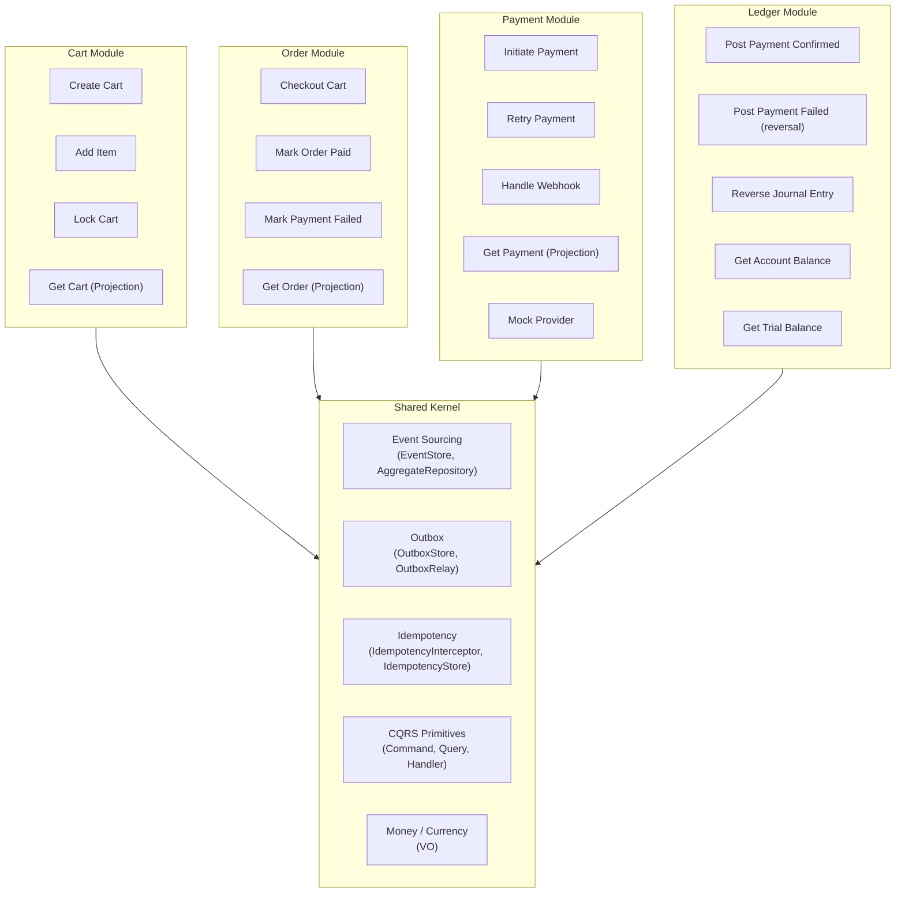
```mermaid
graph TD
    subgraph SK ["Shared Kernel"]
        ES["Event Sourcing\n(EventStore, AggregateRepository)"]
        OB["Outbox\n(OutboxStore, OutboxRelay)"]
        ID["Idempotency\n(IdempotencyInterceptor, IdempotencyStore)"]
        CQRS["CQRS Primitives\n(Command, Query, Handler)"]
        MON["Money / Currency\n(VO)"]
    end

    subgraph CART ["Cart Module"]
        C1["Create Cart"]
        C2["Add Item"]
        C3["Lock Cart"]
        C4["Get Cart (Projection)"]
    end

    subgraph ORDER ["Order Module"]
        O1["Checkout Cart"]
        O2["Mark Order Paid"]
        O3["Mark Payment Failed"]
        O4["Get Order (Projection)"]
    end

    subgraph PAYMENT ["Payment Module"]
        P1["Initiate Payment"]
        P2["Retry Payment"]
        P3["Handle Webhook"]
        P4["Get Payment (Projection)"]
        P5["Mock Provider"]
    end

    subgraph LEDGER ["Ledger Module"]
        L1["Post Payment Confirmed"]
        L2["Post Payment Failed (reversal)"]
        L3["Reverse Journal Entry"]
        L4["Get Account Balance"]
        L5["Get Trial Balance"]
    end

    CART --> SK
    ORDER --> SK
    PAYMENT --> SK
    LEDGER --> SK
```

---

### 4.3 Component and Connector View

**Viewpoint:** VP-03

There are two kinds of connectors in this system. Synchronous facade calls happen in the same transaction — the Order module calls CartFacade to get a snapshot and lock the cart before creating the order. Asynchronous outbox-relay-to-listener calls happen in a separate transaction with REQUIRES_NEW semantics — this is how integration events cross module boundaries without direct coupling.

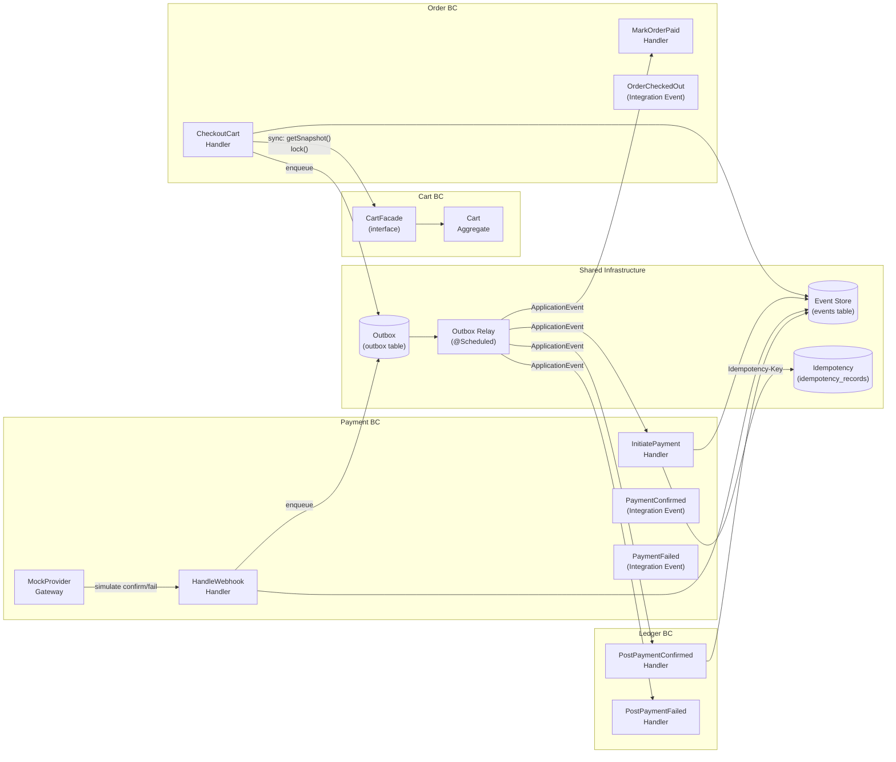
```mermaid
graph LR
    subgraph CART_BC ["Cart BC"]
        CF["CartFacade\n(interface)"]
        CA["Cart\nAggregate"]
    end

    subgraph ORDER_BC ["Order BC"]
        OH["CheckoutCart\nHandler"]
        OM["MarkOrderPaid\nHandler"]
        OE["OrderCheckedOut\n(Integration Event)"]
    end

    subgraph PAYMENT_BC ["Payment BC"]
        PH["InitiatePayment\nHandler"]
        PWH["HandleWebhook\nHandler"]
        PL["PaymentConfirmed\n(Integration Event)"]
        PF["PaymentFailed\n(Integration Event)"]
        MP["MockProvider\nGateway"]
    end

    subgraph LEDGER_BC ["Ledger BC"]
        LH["PostPaymentConfirmed\nHandler"]
        LF["PostPaymentFailed\nHandler"]
    end

    subgraph INFRA ["Shared Infrastructure"]
        EVS[("Event Store\n(events table)")]
        OBX[("Outbox\n(outbox table)")]
        IDP[("Idempotency\n(idempotency_records)")]
        RELAY["Outbox Relay\n(@Scheduled)"]
    end

    OH -->|"sync: getSnapshot()\nlock()"| CF
    CF --> CA

    OH -->|"enqueue"| OBX
    OBX --> RELAY
    RELAY -->|"ApplicationEvent"| PH

    PWH -->|"enqueue"| OBX
    RELAY -->|"ApplicationEvent"| OM
    RELAY -->|"ApplicationEvent"| LH
    RELAY -->|"ApplicationEvent"| LF

    OH --> EVS
    PH --> EVS
    PWH --> EVS
    LH --> EVS

    PH -->|"Idempotency-Key"| IDP
    MP -->|"simulate confirm/fail"| PWH
```

> **Connector semantics:**
> - Solid arrows within a TX boundary = same ACID transaction
> - Outbox -> Relay -> Listener = at-least-once, separate transaction (REQUIRES_NEW)

---

### 4.4 Information View — Domain Models

**Viewpoint:** VP-04

#### 4.4.1 Cart Domain

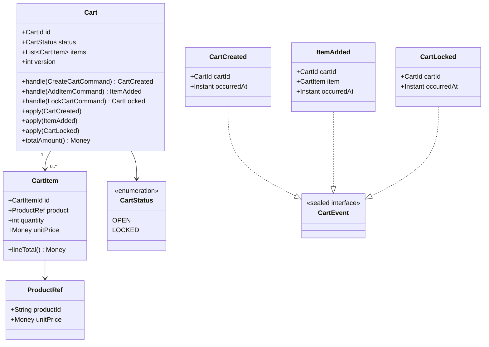
```mermaid
classDiagram
    class Cart {
        +CartId id
        +CartStatus status
        +List~CartItem~ items
        +int version
        +handle(CreateCartCommand) CartCreated
        +handle(AddItemCommand) ItemAdded
        +handle(LockCartCommand) CartLocked
        +apply(CartCreated)
        +apply(ItemAdded)
        +apply(CartLocked)
        +totalAmount() Money
    }

    class CartItem {
        +CartItemId id
        +ProductRef product
        +int quantity
        +Money unitPrice
        +lineTotal() Money
    }

    class ProductRef {
        +String productId
        +Money unitPrice
    }

    class CartStatus {
        <<enumeration>>
        OPEN
        LOCKED
    }

    class CartEvent {
        <<sealed interface>>
    }

    class CartCreated {
        +CartId cartId
        +Instant occurredAt
    }

    class ItemAdded {
        +CartId cartId
        +CartItem item
        +Instant occurredAt
    }

    class CartLocked {
        +CartId cartId
        +Instant occurredAt
    }

    Cart "1" --> "0..*" CartItem
    CartItem --> ProductRef
    Cart --> CartStatus
    CartCreated ..|> CartEvent
    ItemAdded ..|> CartEvent
    CartLocked ..|> CartEvent
```

#### 4.4.2 Order Domain

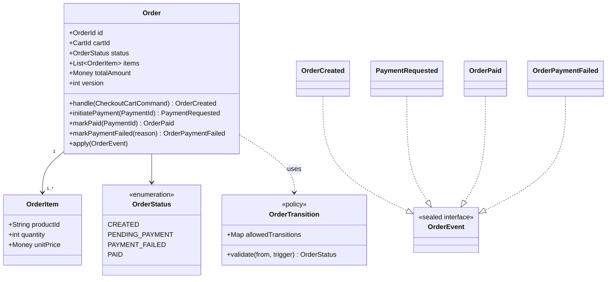
```mermaid
classDiagram
    class Order {
        +OrderId id
        +CartId cartId
        +OrderStatus status
        +List~OrderItem~ items
        +Money totalAmount
        +int version
        +handle(CheckoutCartCommand) OrderCreated
        +initiatePayment(PaymentId) PaymentRequested
        +markPaid(PaymentId) OrderPaid
        +markPaymentFailed(reason) OrderPaymentFailed
        +apply(OrderEvent)
    }

    class OrderItem {
        +String productId
        +int quantity
        +Money unitPrice
    }

    class OrderStatus {
        <<enumeration>>
        CREATED
        PENDING_PAYMENT
        PAYMENT_FAILED
        PAID
    }

    class OrderTransition {
        <<policy>>
        +Map allowedTransitions
        +validate(from, trigger) OrderStatus
    }

    class OrderEvent {
        <<sealed interface>>
    }

    class OrderCreated
    class PaymentRequested
    class OrderPaid
    class OrderPaymentFailed

    Order "1" --> "1..*" OrderItem
    Order --> OrderStatus
    Order ..> OrderTransition : uses
    OrderCreated ..|> OrderEvent
    PaymentRequested ..|> OrderEvent
    OrderPaid ..|> OrderEvent
    OrderPaymentFailed ..|> OrderEvent
```

#### 4.4.3 Payment Domain

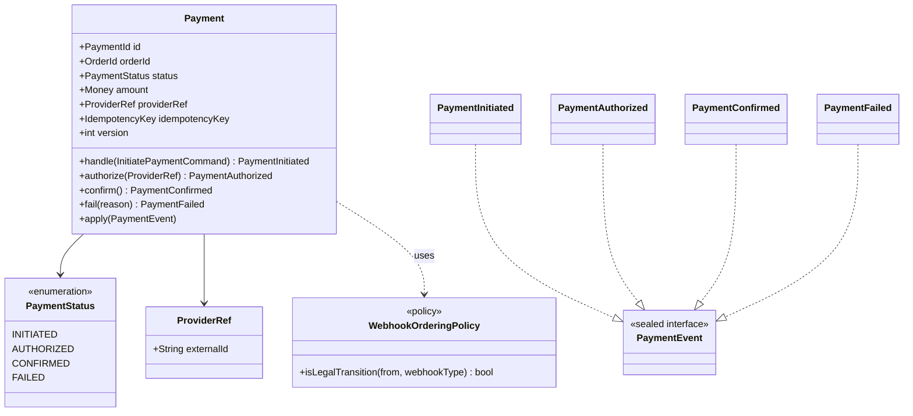
```mermaid
classDiagram
    class Payment {
        +PaymentId id
        +OrderId orderId
        +PaymentStatus status
        +Money amount
        +ProviderRef providerRef
        +IdempotencyKey idempotencyKey
        +int version
        +handle(InitiatePaymentCommand) PaymentInitiated
        +authorize(ProviderRef) PaymentAuthorized
        +confirm() PaymentConfirmed
        +fail(reason) PaymentFailed
        +apply(PaymentEvent)
    }

    class PaymentStatus {
        <<enumeration>>
        INITIATED
        AUTHORIZED
        CONFIRMED
        FAILED
    }

    class ProviderRef {
        +String externalId
    }

    class PaymentEvent {
        <<sealed interface>>
    }

    class PaymentInitiated
    class PaymentAuthorized
    class PaymentConfirmed
    class PaymentFailed

    class WebhookOrderingPolicy {
        <<policy>>
        +isLegalTransition(from, webhookType) bool
    }

    Payment --> PaymentStatus
    Payment --> ProviderRef
    Payment ..> WebhookOrderingPolicy : uses
    PaymentInitiated ..|> PaymentEvent
    PaymentAuthorized ..|> PaymentEvent
    PaymentConfirmed ..|> PaymentEvent
    PaymentFailed ..|> PaymentEvent
```

#### 4.4.4 Ledger Domain

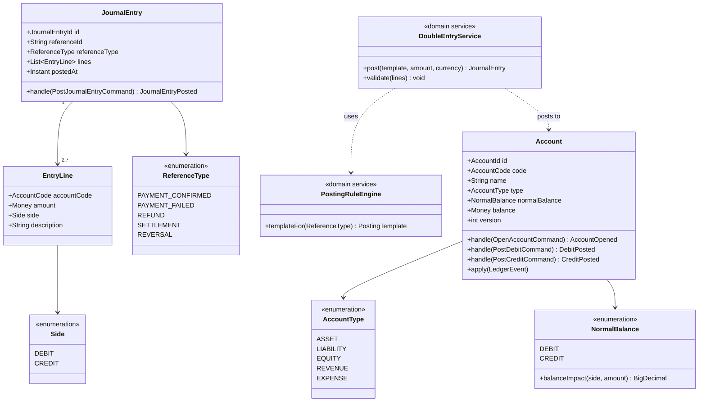
```mermaid
classDiagram
    class Account {
        +AccountId id
        +AccountCode code
        +String name
        +AccountType type
        +NormalBalance normalBalance
        +Money balance
        +int version
        +handle(OpenAccountCommand) AccountOpened
        +handle(PostDebitCommand) DebitPosted
        +handle(PostCreditCommand) CreditPosted
        +apply(LedgerEvent)
    }

    class JournalEntry {
        +JournalEntryId id
        +String referenceId
        +ReferenceType referenceType
        +List~EntryLine~ lines
        +Instant postedAt
        +handle(PostJournalEntryCommand) JournalEntryPosted
    }

    class EntryLine {
        +AccountCode accountCode
        +Money amount
        +Side side
        +String description
    }

    class AccountType {
        <<enumeration>>
        ASSET
        LIABILITY
        EQUITY
        REVENUE
        EXPENSE
    }

    class NormalBalance {
        <<enumeration>>
        DEBIT
        CREDIT
        +balanceImpact(side, amount) BigDecimal
    }

    class Side {
        <<enumeration>>
        DEBIT
        CREDIT
    }

    class ReferenceType {
        <<enumeration>>
        PAYMENT_CONFIRMED
        PAYMENT_FAILED
        REFUND
        SETTLEMENT
        REVERSAL
    }

    class DoubleEntryService {
        <<domain service>>
        +post(template, amount, currency) JournalEntry
        +validate(lines) void
    }

    class PostingRuleEngine {
        <<domain service>>
        +templateFor(ReferenceType) PostingTemplate
    }

    JournalEntry "1" --> "2..*" EntryLine
    Account --> AccountType
    Account --> NormalBalance
    EntryLine --> Side
    JournalEntry --> ReferenceType
    DoubleEntryService ..> PostingRuleEngine : uses
    DoubleEntryService ..> Account : posts to
```

---

### 4.5 Information View — State Machines

**Viewpoint:** VP-05

#### 4.5.1 Order State Machine

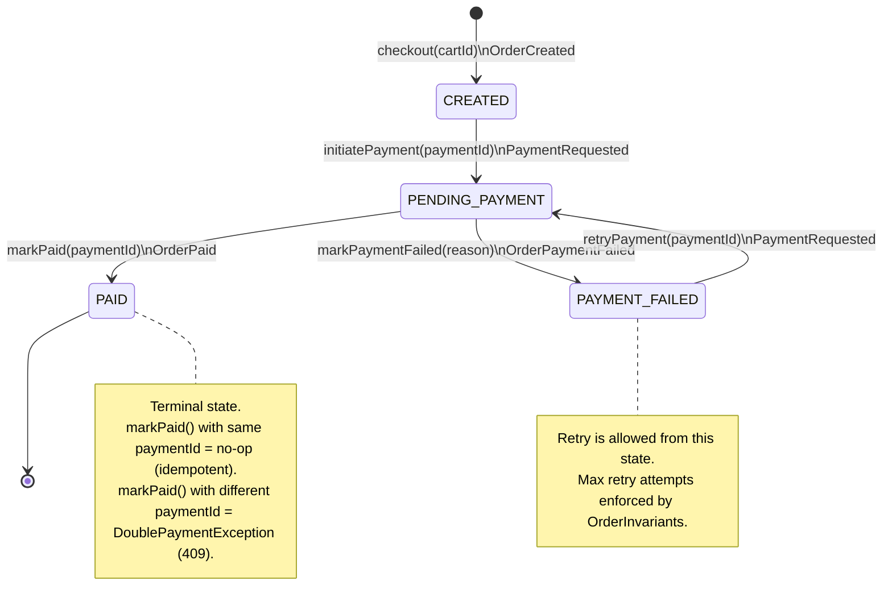
```mermaid
stateDiagram-v2
    [*] --> CREATED : checkout(cartId)\nOrderCreated

    CREATED --> PENDING_PAYMENT : initiatePayment(paymentId)\nPaymentRequested

    PENDING_PAYMENT --> PAID : markPaid(paymentId)\nOrderPaid

    PENDING_PAYMENT --> PAYMENT_FAILED : markPaymentFailed(reason)\nOrderPaymentFailed

    PAYMENT_FAILED --> PENDING_PAYMENT : retryPayment(paymentId)\nPaymentRequested

    PAID --> [*]

    note right of PAID
        Terminal state.
        markPaid() with same paymentId = no-op (idempotent).
        markPaid() with different paymentId = DoublePaymentException (409).
    end note

    note right of PAYMENT_FAILED
        Retry is allowed from this state.
        Max retry attempts enforced by OrderInvariants.
    end note
```

#### 4.5.2 Payment State Machine

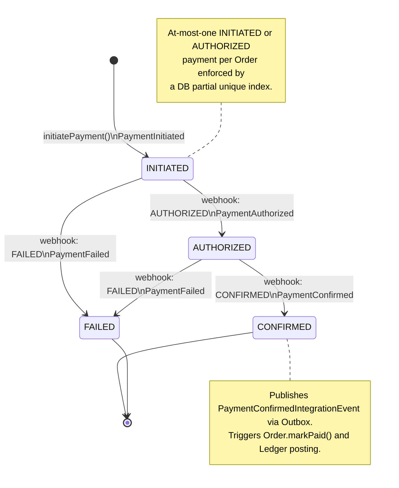
```mermaid
stateDiagram-v2
    [*] --> INITIATED : initiatePayment()\nPaymentInitiated

    INITIATED --> AUTHORIZED : webhook: AUTHORIZED\nPaymentAuthorized

    INITIATED --> FAILED : webhook: FAILED\nPaymentFailed

    AUTHORIZED --> CONFIRMED : webhook: CONFIRMED\nPaymentConfirmed

    AUTHORIZED --> FAILED : webhook: FAILED\nPaymentFailed

    CONFIRMED --> [*]
    FAILED --> [*]

    note right of CONFIRMED
        Publishes PaymentConfirmedIntegrationEvent via Outbox.
        Triggers Order.markPaid() and Ledger posting.
    end note

    note left of INITIATED
        At-most-one INITIATED or AUTHORIZED
        payment per Order enforced by
        a DB partial unique index.
    end note
```

#### 4.5.3 Cart State Machine

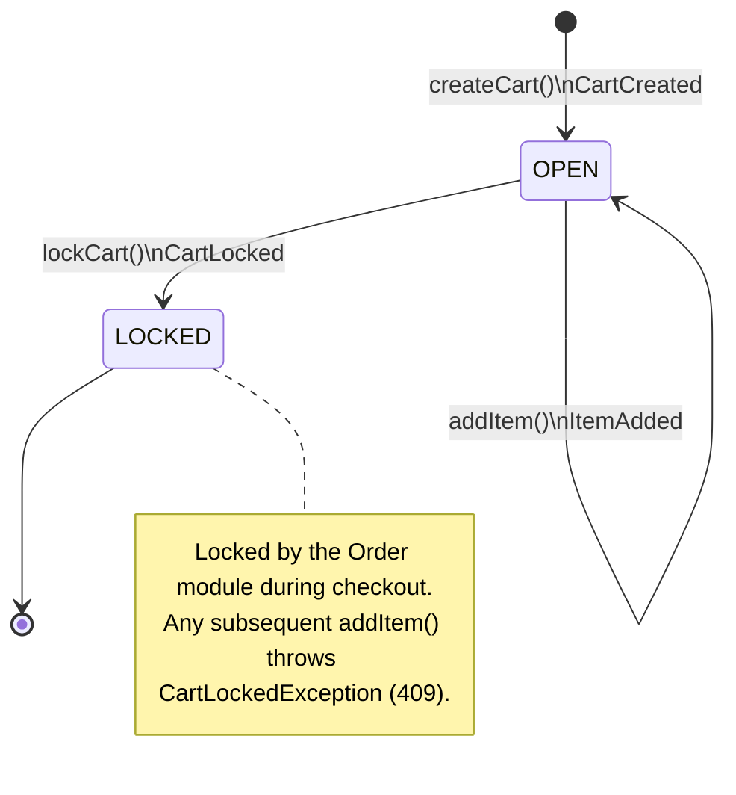
```mermaid
stateDiagram-v2
    [*] --> OPEN : createCart()\nCartCreated
    OPEN --> OPEN : addItem()\nItemAdded
    OPEN --> LOCKED : lockCart()\nCartLocked
    LOCKED --> [*]

    note right of LOCKED
        Locked by the Order module during checkout.
        Any subsequent addItem() throws CartLockedException (409).
    end note
```

---

### 4.6 Process View — Key Flows

**Viewpoint:** VP-06

#### Flow 1 — Cart Checkout (Happy Path)

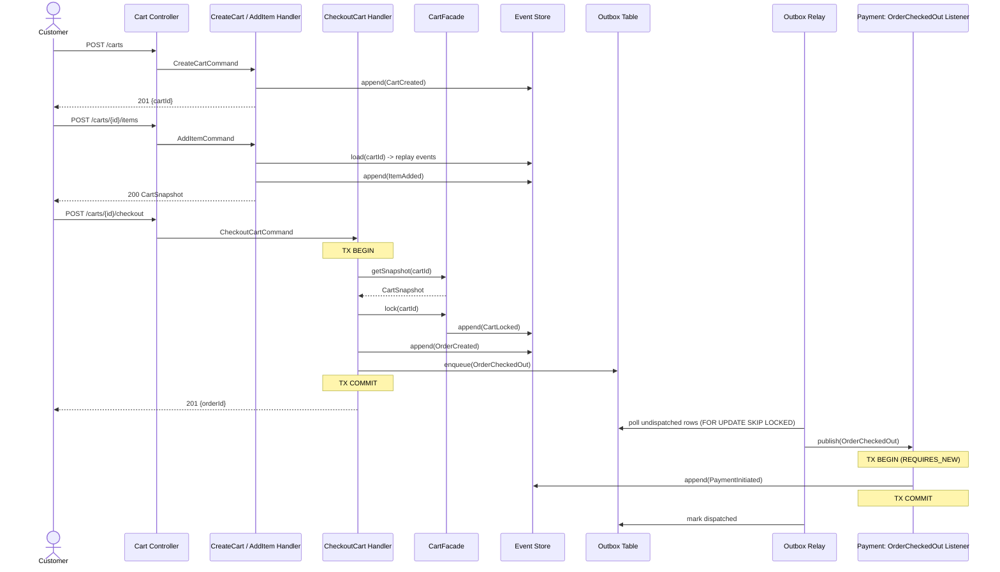
```mermaid
sequenceDiagram
    actor Customer
    participant CartCtrl as Cart Controller
    participant CartHandler as CreateCart / AddItem Handler
    participant CheckoutHandler as CheckoutCart Handler
    participant CartFacade as CartFacade
    participant EventStore as Event Store
    participant Outbox as Outbox Table
    participant Relay as Outbox Relay
    participant PaymentListener as Payment: OrderCheckedOut Listener

    Customer->>CartCtrl: POST /carts
    CartCtrl->>CartHandler: CreateCartCommand
    CartHandler->>EventStore: append(CartCreated)
    CartHandler-->>Customer: 201 {cartId}

    Customer->>CartCtrl: POST /carts/{id}/items
    CartCtrl->>CartHandler: AddItemCommand
    CartHandler->>EventStore: load(cartId) -> replay events
    CartHandler->>EventStore: append(ItemAdded)
    CartHandler-->>Customer: 200 CartSnapshot

    Customer->>CartCtrl: POST /carts/{id}/checkout
    CartCtrl->>CheckoutHandler: CheckoutCartCommand
    Note over CheckoutHandler: TX BEGIN
    CheckoutHandler->>CartFacade: getSnapshot(cartId)
    CartFacade-->>CheckoutHandler: CartSnapshot
    CheckoutHandler->>CartFacade: lock(cartId)
    CartFacade->>EventStore: append(CartLocked)
    CheckoutHandler->>EventStore: append(OrderCreated)
    CheckoutHandler->>Outbox: enqueue(OrderCheckedOut)
    Note over CheckoutHandler: TX COMMIT
    CheckoutHandler-->>Customer: 201 {orderId}

    Relay->>Outbox: poll undispatched rows (FOR UPDATE SKIP LOCKED)
    Relay->>PaymentListener: publish(OrderCheckedOut)
    Note over PaymentListener: TX BEGIN (REQUIRES_NEW)
    PaymentListener->>EventStore: append(PaymentInitiated)
    Note over PaymentListener: TX COMMIT
    Relay->>Outbox: mark dispatched
```

---

#### Flow 2 — Payment Initiation with Idempotency

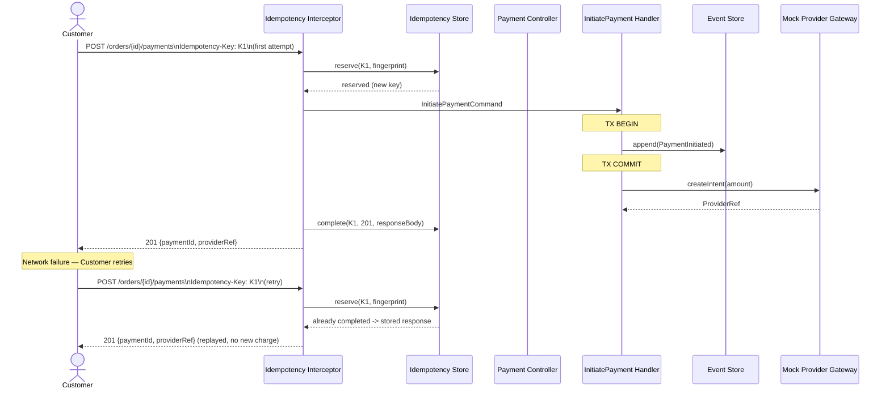
```mermaid
sequenceDiagram
    actor Customer
    participant Interceptor as Idempotency Interceptor
    participant IdempotencyStore as Idempotency Store
    participant PaymentCtrl as Payment Controller
    participant Handler as InitiatePayment Handler
    participant EventStore as Event Store
    participant MockProvider as Mock Provider Gateway

    Customer->>Interceptor: POST /orders/{id}/payments\nIdempotency-Key: K1\n(first attempt)
    Interceptor->>IdempotencyStore: reserve(K1, fingerprint)
    IdempotencyStore-->>Interceptor: reserved (new key)
    Interceptor->>Handler: InitiatePaymentCommand
    Note over Handler: TX BEGIN
    Handler->>EventStore: append(PaymentInitiated)
    Note over Handler: TX COMMIT
    Handler->>MockProvider: createIntent(amount)
    MockProvider-->>Handler: ProviderRef
    Interceptor->>IdempotencyStore: complete(K1, 201, responseBody)
    Interceptor-->>Customer: 201 {paymentId, providerRef}

    Note over Customer: Network failure — Customer retries

    Customer->>Interceptor: POST /orders/{id}/payments\nIdempotency-Key: K1\n(retry)
    Interceptor->>IdempotencyStore: reserve(K1, fingerprint)
    IdempotencyStore-->>Interceptor: already completed -> stored response
    Interceptor-->>Customer: 201 {paymentId, providerRef} (replayed, no new charge)
```

---

#### Flow 3 — Webhook Handling with Deduplication

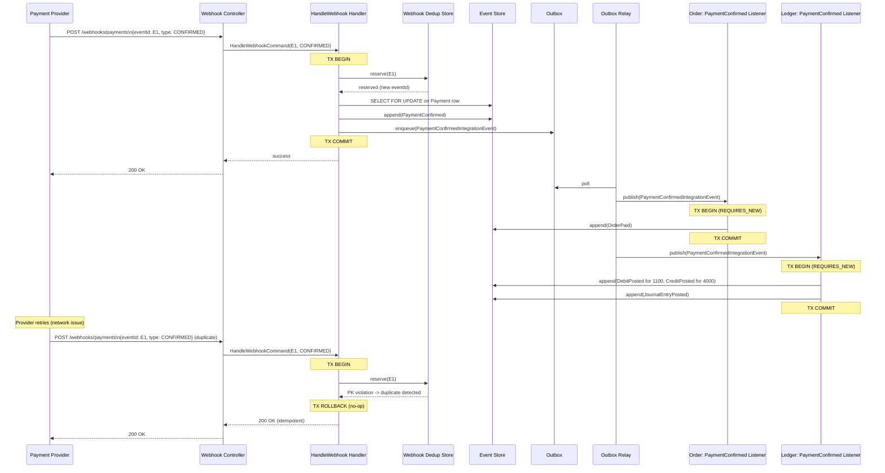
```mermaid
sequenceDiagram
    participant Provider as Payment Provider
    participant WebhookCtrl as Webhook Controller
    participant Handler as HandleWebhook Handler
    participant DedupStore as Webhook Dedup Store
    participant EventStore as Event Store
    participant Outbox as Outbox
    participant Relay as Outbox Relay
    participant OrderListener as Order: PaymentConfirmed Listener
    participant LedgerListener as Ledger: PaymentConfirmed Listener

    Provider->>WebhookCtrl: POST /webhooks/payments\n{eventId: E1, type: CONFIRMED}
    WebhookCtrl->>Handler: HandleWebhookCommand(E1, CONFIRMED)
    Note over Handler: TX BEGIN
    Handler->>DedupStore: reserve(E1)
    DedupStore-->>Handler: reserved (new eventId)
    Handler->>EventStore: SELECT FOR UPDATE on Payment row
    Handler->>EventStore: append(PaymentConfirmed)
    Handler->>Outbox: enqueue(PaymentConfirmedIntegrationEvent)
    Note over Handler: TX COMMIT
    Handler-->>WebhookCtrl: success
    WebhookCtrl-->>Provider: 200 OK

    Relay->>Outbox: poll
    Relay->>OrderListener: publish(PaymentConfirmedIntegrationEvent)
    Note over OrderListener: TX BEGIN (REQUIRES_NEW)
    OrderListener->>EventStore: append(OrderPaid)
    Note over OrderListener: TX COMMIT

    Relay->>LedgerListener: publish(PaymentConfirmedIntegrationEvent)
    Note over LedgerListener: TX BEGIN (REQUIRES_NEW)
    LedgerListener->>EventStore: append(DebitPosted for 1100, CreditPosted for 4000)
    LedgerListener->>EventStore: append(JournalEntryPosted)
    Note over LedgerListener: TX COMMIT

    Note over Provider: Provider retries (network issue)
    Provider->>WebhookCtrl: POST /webhooks/payments\n{eventId: E1, type: CONFIRMED} (duplicate)
    WebhookCtrl->>Handler: HandleWebhookCommand(E1, CONFIRMED)
    Note over Handler: TX BEGIN
    Handler->>DedupStore: reserve(E1)
    DedupStore-->>Handler: PK violation -> duplicate detected
    Note over Handler: TX ROLLBACK (no-op)
    Handler-->>WebhookCtrl: 200 OK (idempotent)
    WebhookCtrl-->>Provider: 200 OK
```

---

#### Flow 4 — Concurrent Payment Initiation Guard

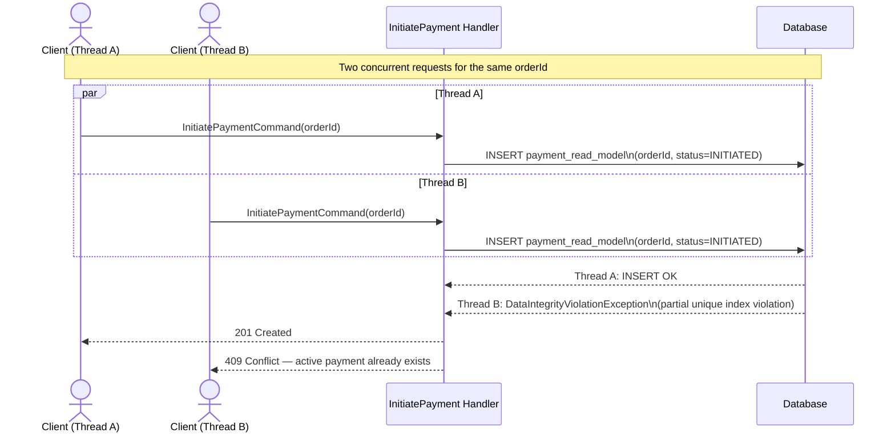
```mermaid
sequenceDiagram
    actor Client1 as Client (Thread A)
    actor Client2 as Client (Thread B)
    participant Handler as InitiatePayment Handler
    participant DB as Database

    Note over Client1, DB: Two concurrent requests for the same orderId

    par Thread A
        Client1->>Handler: InitiatePaymentCommand(orderId)
        Handler->>DB: INSERT payment_read_model\n(orderId, status=INITIATED)
    and Thread B
        Client2->>Handler: InitiatePaymentCommand(orderId)
        Handler->>DB: INSERT payment_read_model\n(orderId, status=INITIATED)
    end

    DB-->>Handler: Thread A: INSERT OK
    DB-->>Handler: Thread B: DataIntegrityViolationException\n(partial unique index violation)

    Handler-->>Client1: 201 Created
    Handler-->>Client2: 409 Conflict — active payment already exists
```

---

#### Flow 5 — Payment Retry after Failure

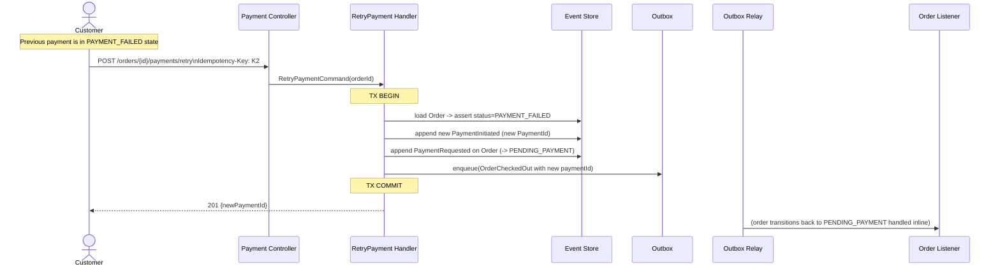
```mermaid
sequenceDiagram
    actor Customer
    participant PaymentCtrl as Payment Controller
    participant RetryHandler as RetryPayment Handler
    participant EventStore as Event Store
    participant Outbox as Outbox
    participant Relay as Outbox Relay
    participant OrderListener as Order Listener

    Note over Customer: Previous payment is in PAYMENT_FAILED state

    Customer->>PaymentCtrl: POST /orders/{id}/payments/retry\nIdempotency-Key: K2
    PaymentCtrl->>RetryHandler: RetryPaymentCommand(orderId)
    Note over RetryHandler: TX BEGIN
    RetryHandler->>EventStore: load Order -> assert status=PAYMENT_FAILED
    RetryHandler->>EventStore: append new PaymentInitiated (new PaymentId)
    RetryHandler->>EventStore: append PaymentRequested on Order (-> PENDING_PAYMENT)
    RetryHandler->>Outbox: enqueue(OrderCheckedOut with new paymentId)
    Note over RetryHandler: TX COMMIT
    RetryHandler-->>Customer: 201 {newPaymentId}

    Relay->>OrderListener: (order transitions back to PENDING_PAYMENT handled inline)
```

---

#### Flow 6 — Event Sourcing Write Path (Generic)

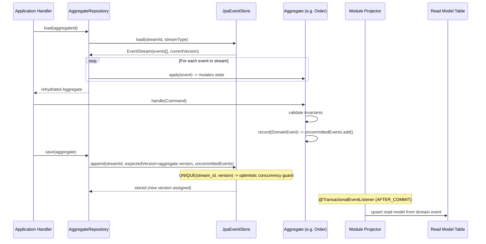
```mermaid
sequenceDiagram
    participant Handler as Application Handler
    participant AggRepo as AggregateRepository
    participant EventStore as JpaEventStore
    participant Aggregate as Aggregate (e.g. Order)
    participant Projector as Module Projector
    participant ReadModel as Read Model Table

    Handler->>AggRepo: load(aggregateId)
    AggRepo->>EventStore: load(streamId, streamType)
    EventStore-->>AggRepo: EventStream(events[], currentVersion)
    loop For each event in stream
        AggRepo->>Aggregate: apply(event) -> mutates state
    end
    AggRepo-->>Handler: rehydrated Aggregate

    Handler->>Aggregate: handle(Command)
    Aggregate->>Aggregate: validate invariants
    Aggregate->>Aggregate: record(DomainEvent) -> uncommittedEvents.add()

    Handler->>AggRepo: save(aggregate)
    AggRepo->>EventStore: append(streamId, expectedVersion=aggregate.version, uncommittedEvents)
    Note over EventStore: UNIQUE(stream_id, version) -> optimistic concurrency guard
    EventStore-->>AggRepo: stored (new version assigned)

    Note over Projector: @TransactionalEventListener (AFTER_COMMIT)
    Projector->>ReadModel: upsert read model from domain event
```

---

### 4.7 Data View — Persistence Schema

**Viewpoint:** VP-07

```mermaid
erDiagram

    %% -- Event Store (shared, multi-tenant by stream_type) --
    events {
        varchar event_id PK
        varchar stream_id
        varchar stream_type
        bigint  version
        varchar event_type
        clob    payload
        timestamp occurred_at
        timestamp recorded_at
    }

    snapshots {
        varchar stream_id PK
        varchar stream_type PK
        bigint  version
        clob    payload
        timestamp taken_at
    }

    %% -- Outbox --
    outbox {
        varchar id PK
        varchar aggregate_type
        varchar aggregate_id
        varchar event_type
        clob    payload
        timestamp created_at
        timestamp dispatched_at
        int     attempt_count
        varchar last_error
        boolean dead
        varchar dead_reason
    }

    %% -- Idempotency --
    idempotency_records {
        varchar key PK
        varchar endpoint
        varchar fingerprint
        int     status_code
        clob    response_body
        timestamp created_at
        timestamp completed_at
    }

    %% -- Cart Read Model --
    cart_read_model {
        varchar cart_id PK
        varchar status
        decimal total_amount
        char    currency
        bigint  version
        timestamp created_at
        timestamp locked_at
    }

    cart_item_read_model {
        varchar id PK
        varchar cart_id FK
        varchar product_id
        int     quantity
        decimal unit_price_amount
        char    unit_price_currency
    }

    %% -- Order Read Model --
    order_read_model {
        varchar order_id PK
        varchar cart_id
        varchar status
        decimal total_amount
        char    currency
        bigint  version
        timestamp created_at
    }

    order_item_read_model {
        varchar id PK
        varchar order_id FK
        varchar product_id
        int     quantity
        decimal unit_price_amount
        char    unit_price_currency
    }

    %% -- Payment Read Model --
    payment_read_model {
        varchar payment_id PK
        varchar order_id
        varchar status
        decimal amount
        char    currency
        varchar provider_ref
        varchar idempotency_key
        bigint  version
        timestamp created_at
        timestamp updated_at
    }

    processed_webhook_events {
        varchar event_id PK
        varchar payment_id FK
        varchar event_type
        timestamp processed_at
    }

    %% -- Ledger Read Model --
    ledger_account {
        varchar account_id PK
        varchar code
        varchar name
        varchar type
        varchar normal_balance
        decimal balance_amount
        char    currency
        bigint  version
    }

    ledger_journal_entry {
        varchar entry_id PK
        varchar reference_id
        varchar reference_type
        timestamp posted_at
    }

    ledger_entry_line {
        varchar id PK
        varchar entry_id FK
        varchar account_code
        decimal amount
        char    currency
        varchar side
        varchar description
    }

    %% -- Relationships --
    cart_read_model ||--o{ cart_item_read_model : contains
    order_read_model ||--o{ order_item_read_model : contains
    payment_read_model ||--o{ processed_webhook_events : deduplicates
    ledger_journal_entry ||--|{ ledger_entry_line : contains
```

> **Key constraints (enforced at DB level):**
> - `UNIQUE(stream_id, stream_type, version)` on `events` — optimistic concurrency
> - `UNIQUE INDEX ux_payment_active ON payment_read_model(order_id) WHERE status IN ('INITIATED','AUTHORIZED')` — concurrent payment guard
> - `UNIQUE(reference_id, reference_type)` on `ledger_journal_entry` — no duplicate ledger postings
> - `PRIMARY KEY(event_id)` on `processed_webhook_events` — webhook dedup

---

### 4.8 Deployment View

**Viewpoint:** VP-08

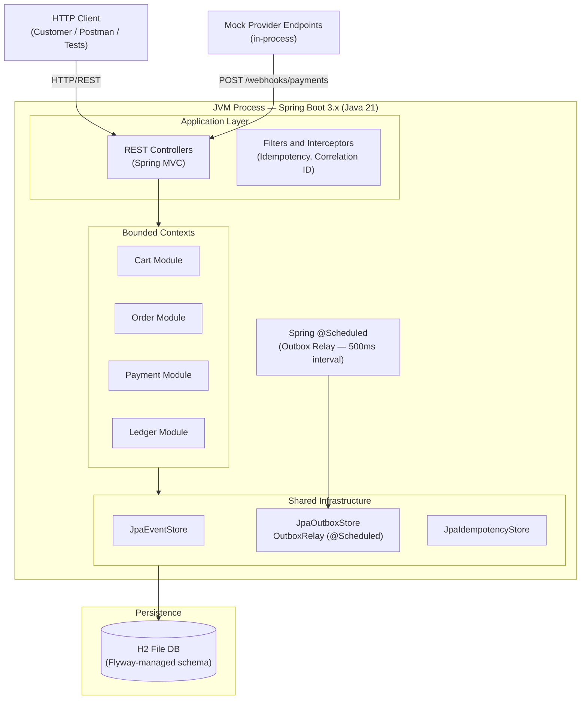
```mermaid
graph TD
    subgraph JVM ["JVM Process — Spring Boot 3.x (Java 21)"]
        subgraph APP ["Application Layer"]
            CTRL["REST Controllers\n(Spring MVC)"]
            FILTER["Filters and Interceptors\n(Idempotency, Correlation ID)"]
        end

        subgraph MODULES ["Bounded Contexts"]
            CART_MOD["Cart Module"]
            ORDER_MOD["Order Module"]
            PAYMENT_MOD["Payment Module"]
            LEDGER_MOD["Ledger Module"]
        end

        subgraph SHARED ["Shared Infrastructure"]
            ES_INFRA["JpaEventStore"]
            OB_INFRA["JpaOutboxStore\nOutboxRelay (@Scheduled)"]
            ID_INFRA["JpaIdempotencyStore"]
        end

        SCHEDULER["Spring @Scheduled\n(Outbox Relay — 500ms interval)"]
    end

    subgraph PERSISTENCE ["Persistence"]
        H2[("H2 File DB\n(Flyway-managed schema)")]
    end

    CLIENT["HTTP Client\n(Customer / Postman / Tests)"]
    PROVIDER["Mock Provider Endpoints\n(in-process)"]

    CLIENT -->|HTTP/REST| CTRL
    CTRL --> MODULES
    MODULES --> SHARED
    SHARED --> H2
    SCHEDULER --> OB_INFRA
    PROVIDER -->|POST /webhooks/payments| CTRL
```

> **Profiles:**
> - `default` — H2 file-mode (data persists across restarts during development)
> - `test` — H2 in-memory (reset between test runs, outbox relay disabled)
> - Future `prod` profile — swap `application-prod.yml` for a PostgreSQL datasource; no code changes required

---

### 4.9 Development View — Module Dependencies

**Viewpoint:** VP-09

```mermaid
graph TD
    subgraph ALLOWED ["Allowed Dependencies"]
        direction TB
        CART_WEB["cart.web"] -->|dispatches to| CART_APP["cart.application"]
        CART_APP -->|uses ports| CART_DOM["cart.domain"]
        CART_APP -->|implements via| CART_INF["cart.infrastructure"]
        CART_INF -->|adapts| CART_DOM

        ORDER_WEB["order.web"] --> ORDER_APP["order.application"]
        ORDER_APP --> ORDER_DOM["order.domain"]
        ORDER_APP -->|"calls cart.application.api.*\n(CartFacade interface)"| CART_API["cart.application.api"]
        ORDER_INF["order.infrastructure"] --> ORDER_DOM

        PAY_WEB["payment.web"] --> PAY_APP["payment.application"]
        PAY_APP --> PAY_DOM["payment.domain"]
        PAY_INF["payment.infrastructure"] --> PAY_DOM

        LED_WEB["ledger.web"] --> LED_APP["ledger.application"]
        LED_APP --> LED_DOM["ledger.domain"]
        LED_INF["ledger.infrastructure"] --> LED_DOM

        ALL["All modules"] -->|"shared.*"| SK["shared kernel"]
    end

    subgraph FORBIDDEN ["Forbidden Dependencies (ArchUnit enforced)"]
        direction TB
        X1["order.* -- CANNOT import --> cart.infrastructure"]
        X2["order.* -- CANNOT import --> cart.domain (direct)"]
        X3["payment.* -- CANNOT import --> order.*"]
        X4["ledger.* -- CANNOT import --> payment.infrastructure"]
        X5["*.domain -- CANNOT use --> Spring annotations"]
        X6["*.domain -- CANNOT use --> JPA annotations"]
        X7["Any module -- CANNOT import --> another module's .web.*"]
    end
```

**Integration event boundaries:**

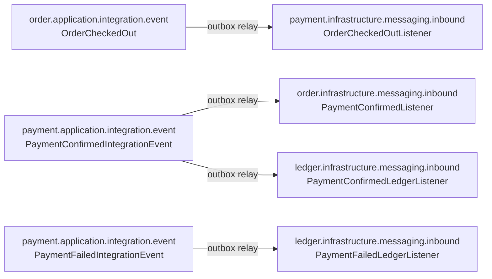
```mermaid
graph LR
    ORDER_INT["order.application.integration.event\nOrderCheckedOut"] -->|"outbox relay"| PAY_LISTENER["payment.infrastructure.messaging.inbound\nOrderCheckedOutListener"]

    PAY_INT1["payment.application.integration.event\nPaymentConfirmedIntegrationEvent"] -->|"outbox relay"| ORDER_LISTENER["order.infrastructure.messaging.inbound\nPaymentConfirmedListener"]

    PAY_INT1 -->|"outbox relay"| LED_LISTENER1["ledger.infrastructure.messaging.inbound\nPaymentConfirmedLedgerListener"]

    PAY_INT2["payment.application.integration.event\nPaymentFailedIntegrationEvent"] -->|"outbox relay"| LED_LISTENER2["ledger.infrastructure.messaging.inbound\nPaymentFailedLedgerListener"]
```

> Only `*.application.integration.event.*` and `*.application.api.*` packages are permitted as cross-module import targets. Everything else is private to the owning module.

---

## 5. Correspondences and Correspondence Rules

### 5.1 Correspondences

| ID | From Element | Relation | To Element |
|---|---|---|---|
| CO-01 | `Order` aggregate | persisted as event stream in | `events` table (stream_type='order') |
| CO-02 | `Order` aggregate | projected into | `order_read_model` table via `OrderProjector` |
| CO-03 | `DomainEvent` (internal) | sourced into aggregate via | `AggregateRepository.load()` replay |
| CO-04 | `IntegrationEvent` | transported via | `outbox` table -> `OutboxRelay` -> `ApplicationEventPublisher` |
| CO-05 | `Idempotency-Key` HTTP header | stored in | `idempotency_records` table keyed by header value |
| CO-06 | `PaymentConfirmedIntegrationEvent` | triggers | `PostPaymentConfirmedHandler` in Ledger module |
| CO-07 | `JournalEntry` aggregate | persisted as event stream in | `events` table (stream_type='ledger-journal') |
| CO-08 | `Account` balance | projected into | `ledger_account.balance_amount` via `LedgerProjector` |
| CO-09 | `CartFacade` interface | implemented by | `CartFacadeImpl` in `cart.infrastructure` |
| CO-10 | Vertical Slice (e.g. `checkout-cart`) | maps 1:1 to | single HTTP endpoint + single Handler class |

### 5.2 Correspondence Rules

| ID | Rule | Enforcement |
|---|---|---|
| CR-01 | Every state-changing command on an aggregate must result in at least one domain event appended to the event store | ArchUnit: all `AggregateRepository.save()` calls must be preceded by `handle()` |
| CR-02 | No domain event may cross module boundaries; only integration events may | ArchUnit: forbid import of `*.domain.event.*` outside the owning module |
| CR-03 | Every integration event must be published via the outbox table, never via direct `ApplicationEventPublisher` call in application handlers | Code review + ArchUnit: handlers may not inject `ApplicationEventPublisher` |
| CR-04 | Every `POST` endpoint that creates a financial resource must carry the idempotency filter | ArchUnit: all `@PostMapping` in `payment.web` must be covered |
| CR-05 | `*.domain.*` packages must not contain Spring or JPA annotations | ArchUnit: no `@Entity`, `@Service`, `@Component`, `@Autowired` in `domain` |
| CR-06 | Module A must not import `module-B.infrastructure.*` or `module-B.web.*` | ArchUnit: package dependency rules per module |
| CR-07 | Every `JournalEntry` must satisfy: sum of DEBIT amounts = sum of CREDIT amounts | `DoubleEntryService.validate()` — throws `UnbalancedEntryException` before any persistence |
| CR-08 | A payment aggregate in `CONFIRMED` or `FAILED` state is terminal — no further events may be appended | `PaymentTransition` policy — throws `InvalidPaymentStateException` |
| CR-09 | The `events` table version column must be monotonically increasing per stream; gaps are forbidden | `JpaEventStore.append()` — unique constraint + sequential version assignment |
| CR-10 | Outbox rows must be dispatched at-least-once; exactly-once delivery is the responsibility of downstream idempotency. Rows that violate a business invariant are dead-lettered immediately; rows that fail transiently are retried up to `scheduling.outbox-max-retries` times before dead-lettering. Dead rows (`dead=TRUE`) are never polled again. | `OutboxRelay` — `NonRetryableException` → immediate dead-letter; other exceptions → retry cap then dead-letter; each listener is idempotent by design |

---

## 6. Architecture Decisions and Rationale

### ADR-001 — Modular Monolith over Microservices

| Field | Detail |
|---|---|
| **Status** | Accepted |
| **Context** | This is a solo quest submission targeting a single deployable artifact. Running multiple services would require service discovery, inter-service networking, distributed tracing, and container orchestration — none of which add value at this scale. |
| **Decision** | Build as a modular monolith. Bounded contexts live in separate Java packages and their boundaries are enforced at compile-time by ArchUnit, not at runtime by network calls. |
| **Rationale** | Microservices solve deployment and team scaling problems. Neither problem exists here. The modular structure gives the same domain isolation as microservices without the operational tax. If requirements change, each bounded context can be extracted into its own service — the domain code stays the same, only the wiring changes. |
| **Trade-offs** | All contexts deploy together and share a JVM heap. This is acceptable because the enforced module boundaries mean a bad deploy in one context cannot silently corrupt another at the domain level. |
| **Consequences** | Module boundary violations are caught as test failures, not runtime errors. The ArchUnit suite is the enforcement mechanism. |

---

### ADR-002 — Event Sourcing for Order, Payment, and Ledger Aggregates

| Field | Detail |
|---|---|
| **Status** | Accepted |
| **Context** | Financial operations need an immutable audit trail. A state-stored aggregate only tells you what the current state is — it loses the sequence of decisions that led there. |
| **Decision** | Order, Payment, and Ledger aggregates are event-sourced. Cart uses the same pattern for codebase consistency, even though its history is less critical. |
| **Rationale** | The event stream is the source of truth. Read models are projections — derived views that can be rebuilt at any time by replaying events. This directly addresses CN-08. It also means schema migrations only touch read model tables; the event payloads are immutable records of history. |
| **Trade-offs** | Write path is more complex than a simple UPDATE statement — events must be serialized, versioned, and replayed on load. For long-lived aggregates, snapshots may be needed to keep load times reasonable. |
| **Consequences** | Every state transition is recoverable from first principles. You can replay events against a new projection at any time to answer questions the original schema did not anticipate. |

---

### ADR-003 — H2 In-Memory Database for Persistence

| Field | Detail |
|---|---|
| **Status** | Accepted |
| **Context** | The quest requires a zero-dependency setup. The evaluator needs to be able to run the project with a single `mvn spring-boot:run` command, no Docker, no external database. |
| **Decision** | H2 with file-mode for the `default` profile, in-memory for `test`. Flyway manages all schema migrations so the schema is always reproducible. |
| **Rationale** | H2 supports the features this system actually needs: partial unique indexes (required for the concurrent payment guard in CN-03), `SELECT FOR UPDATE`, and proper transaction semantics. Spring Boot autoconfigures everything — there is nothing to install. |
| **Trade-offs** | H2 is not a production database. However, the only change needed to switch to PostgreSQL is a datasource URL in `application-prod.yml`. The application code is completely database-agnostic. |
| **Consequences** | The test suite runs against a real database (not mocks), which means the partial unique index and constraint-based idempotency guards are tested the same way they run in production. |

---

### ADR-004 — Transactional Outbox for Cross-Module Integration Events

| Field | Detail |
|---|---|
| **Status** | Accepted |
| **Context** | When a payment is confirmed, both the Order module and the Ledger module need to react. If we published events directly to `ApplicationEventPublisher` after the database commit, a process crash in between would silently lose those events. |
| **Decision** | All cross-module integration events are written to an `outbox` table in the same transaction as the aggregate event store write. A `@Scheduled` relay polls the outbox and publishes pending events using `ApplicationEventPublisher`. |
| **Rationale** | Writing the event and the outbox row in the same transaction guarantees they are either both committed or both rolled back. There is no window where the domain state changed but the downstream reaction was lost. This is the standard solution to the dual-write problem and directly addresses CN-07. |
| **Trade-offs** | The relay introduces up to 500ms of latency between a domain event and its downstream reaction. The relay is single-threaded — adequate for this scope, but a partitioned relay with `SKIP LOCKED` would handle higher throughput. |
| **Consequences** | Swapping `ApplicationEventPublisher` for Kafka or RabbitMQ requires only an adapter change in the relay. The domain code and the outbox contract do not change. Failed delivery is handled by the dead-letter mechanism described in ADR-011. |

---

### ADR-005 — Three-Layer Idempotency Strategy

| Field | Detail |
|---|---|
| **Status** | Accepted |
| **Context** | Three genuinely different failure modes affect payment correctness: clients retrying after a network timeout, two threads racing to initiate payment for the same order, and the payment provider resending a webhook that was already processed. A single mechanism cannot cover all three. |
| **Decision** | Layer 1 — `Idempotency-Key` header stored in `idempotency_records`: if the key is seen again after completion, the stored response is replayed with no side effects. Layer 2 — partial unique index on `payment_read_model(order_id)` where status is INITIATED or AUTHORIZED: the database rejects a second active payment before any application logic runs. Layer 3 — `processed_webhook_events(event_id PK)`: inserting a duplicate event_id throws a primary key violation, which the handler catches and converts to a no-op. |
| **Rationale** | Application-level checks alone are vulnerable to TOCTOU races under concurrent load. Each layer targets a distinct attack surface. Removing any one of them leaves a real vulnerability open. This addresses CN-01, CN-02, CN-03, and CN-09. |
| **Trade-offs** | Three mechanisms to understand and maintain. The complexity is load-bearing — it is not accidental. |
| **Consequences** | The payment flow is safe under client retry, concurrent initiation, and unreliable webhook delivery from the provider. |

---

### ADR-006 — Vertical Slice Architecture within Bounded Contexts

| Field | Detail |
|---|---|
| **Status** | Accepted |
| **Context** | A traditional layered architecture (Controller -> Service -> Repository) scatters the implementation of a single use case across three directories. Every feature change becomes a cross-cutting edit. |
| **Decision** | Each use case is a self-contained vertical slice: one package containing the Command or Query, the Handler, and any supporting types. Controllers dispatch to handlers and do nothing else. |
| **Rationale** | Cohesion lives at the use case level, not the layer level. Adding a new feature means adding a new package. Deleting a feature means deleting a package. The blast radius of any change is bounded to a single folder. The aggregate and domain model remain shared within a bounded context — they are not duplicated per slice. |
| **Trade-offs** | Slices that share common loading patterns will have some duplication. I prefer this over a premature abstraction that couples independent slices to a shared base class. |
| **Consequences** | Code reviews are scoped to feature folders. Feature branches rarely produce merge conflicts because different features touch different directories. |

---

### ADR-007 — UUIDv7 for All Entity Identifiers

| Field | Detail |
|---|---|
| **Status** | Accepted |
| **Context** | UUIDv4 identifiers are random — good for uniqueness but terrible for B-tree index performance because they scatter writes across the entire index. Auto-increment integers are sequential but leak row counts and create a coordination point when scaling across services. |
| **Decision** | All entity identifiers use UUIDv7, generated in the application layer through a small `UuidV7` utility class. |
| **Rationale** | UUIDv7 encodes a millisecond-precision timestamp in the high bits, so identifiers are monotonically increasing within the same millisecond. This gives index locality similar to auto-increment while remaining globally unique without any database sequence or coordination. It also makes the IDs themselves informative — you can extract the creation time directly from the ID. |
| **Trade-offs** | Java's standard library does not include a UUIDv7 generator, so a small utility class is needed. It is straightforward to implement and has no external dependencies. |
| **Consequences** | All `event_id`, `stream_id`, and aggregate primary keys are naturally time-sorted and index-friendly. |

---

### ADR-008 — Double-Entry General Ledger as a Bounded Context

| Field | Detail |
|---|---|
| **Status** | Accepted |
| **Context** | The quest requires financial correctness. A payment record by itself says an amount moved from one place to another — it does not prove the books balance. Double-entry bookkeeping is the industry standard precisely because it makes imbalance structurally impossible. |
| **Decision** | A dedicated `Ledger` bounded context implements double-entry bookkeeping. It is purely downstream: it listens to integration events from Payment and never publishes to other modules. |
| **Rationale** | The invariant that sum of debits equals sum of credits is enforced by `DoubleEntryService.validate()` before any ledger entry reaches the database. This is a domain-level guarantee, not a reporting afterthought. The `PostingRuleEngine` maps each event type to a balanced posting template so no handler has to remember which accounts to debit and credit. The trial balance endpoint provides a machine-verifiable proof that the ledger is correct at any moment. This directly addresses CN-05. |
| **Trade-offs** | Adding a full bounded context with aggregates, projections, and seeded accounts is non-trivial scope. It is justified by the financial correctness quality attribute, which is listed as Critical. |
| **Consequences** | A GET /ledger/trial-balance call returns a balance sheet that proves no money was created or destroyed by the system. |

---

### ADR-009 — Hand-Rolled State Machine over Spring State Machine

| Field | Detail |
|---|---|
| **Status** | Accepted |
| **Context** | Order and Payment both have explicit state machines with transition guards. Spring State Machine exists as a framework option. |
| **Decision** | State machines are implemented as table-driven policy classes inside each aggregate — `OrderTransition` and `WebhookOrderingPolicy` — using plain Java Maps. No external framework. |
| **Rationale** | State machine logic belongs to the domain. It enforces business invariants. Coupling it to a framework would put framework annotations or configuration inside the domain layer, which violates the dependency rule from Clean Architecture. A Map<State, Set<State>> is self-documenting, trivially unit-testable without a Spring context, and has zero configuration overhead. Spring State Machine is a powerful tool for complex statecharts — it is significant overkill for a four-state machine. |
| **Trade-offs** | More explicit code than an annotation-driven framework. The explicitness is the point — every allowed transition is visible in one place and has no hidden framework magic. |
| **Consequences** | State machine tests are pure JUnit with no Spring context. They run in sub-millisecond time and produce clear failure messages that name the exact invalid transition. |

---

### ADR-011 — Dead-Letter Strategy for the Outbox Relay

| Field | Detail |
|---|---|
| **Status** | Accepted |
| **Context** | The outbox relay must dispatch every message at-least-once, but an unbounded retry loop is dangerous. Two structurally different failure modes exist. First, a message whose listener throws a domain business rule violation — for example, `InvalidOrderTransitionException` when `PaymentInitiatedIntegrationEvent` arrives for an order that is already `PAID`. Retrying this message will always throw the same exception; the aggregate state is the invariant, not a transient condition. Second, a message that fails due to a transient infrastructure error — serialization failure, database timeout, dependency unavailability. These failures may resolve on their own if the message is retried after a short interval. Treating both failure modes identically forces an impossible choice: either retry business violations forever (wasted work, log noise, obscured failures) or dead-letter on first failure (losing recoverable messages). |
| **Decision** | Two-branch dead-letter strategy based on exception type. Domain business rule violations — identified by `NonRetryableException`, an abstract base class in the shared kernel that all domain invariant exceptions extend — are dead-lettered on the first failure without any retry. Transient failures are retried up to `scheduling.outbox-max-retries` (default 5) attempts. If all attempts are exhausted the row is also dead-lettered. Dead-lettering sets `dead=TRUE` and records the `dead_reason` on the outbox row. The `findUndispatched` query filters `dead=FALSE`, so dead rows are never polled again. |
| **Rationale** | The distinction is structural: a `NonRetryableException` represents a business invariant violation whose root cause is in the current system state, not in a transient external condition. `InvalidOrderTransitionException`, `Order.DoublePaymentException`, and `Payment.InvalidPaymentStateException` all extend `NonRetryableException`. Retrying any of these is equivalent to retrying a validation error — the aggregate state does not change between relay ticks. Marking the outbox row dead instead of logging and moving on makes the failure visible and queryable: `SELECT * FROM outbox WHERE dead = TRUE` is a complete dead-letter queue that retains the full message payload, error chain, and attempt count for replay or investigation. |
| **Trade-offs** | Domain exception classes must remember to extend `NonRetryableException`. A business rule violation that extends `RuntimeException` directly would be retried up to `max-retries` times before dead-lettering, which is harmless but wastes cycles and log lines. This is mitigated by the fact that all current domain exception classes are in the shared module structure, reviewed as part of adding each bounded context. |
| **Consequences** | The outbox relay loop is bounded — no message retries indefinitely. Dead-lettered rows are observable at the database level and carry enough context to replay manually by setting `dead=FALSE, attempt_count=0`. The `dead_reason` column contains a human-readable string prefixed with either `NON_RETRYABLE:` or `RETRY_EXHAUSTED after N attempts:`, making triage immediate. |

---

### ADR-010 — Optimistic Locking for Aggregates, Pessimistic Locking for Webhooks

| Field | Detail |
|---|---|
| **Status** | Accepted |
| **Context** | Concurrent writes to the same aggregate need to be detected and rejected. Webhook processing presents a different concurrency pattern — multiple deliveries of the same event arriving in rapid succession. |
| **Decision** | Aggregate saves use optimistic locking via the `UNIQUE(stream_id, version)` constraint on the events table. Any concurrent write that tries to append to the same stream position gets a `DataIntegrityViolationException`, which the repository translates into a `ConcurrencyException` and returns a 409 to the caller. Webhook processing uses `SELECT FOR UPDATE` on the Payment row before applying the transition, serializing concurrent webhook delivery for the same payment. |
| **Rationale** | Optimistic locking is the right default for user-facing commands because collisions are rare and the failure is clean — the caller gets a 409 and can retry with fresh state. Webhooks from a provider can arrive in fast bursts for the same payment, and the ordering matters. Pessimistic locking serializes that processing at the cost of a lock wait, which is acceptable because webhook latency is not user-facing. |
| **Trade-offs** | `SELECT FOR UPDATE` on the webhook path serializes concurrent webhook delivery for the same payment. This is intentional and documented. Under very high webhook throughput it could become a bottleneck, but that is out of scope for this system. |
| **Consequences** | No two webhook handlers can concurrently mutate the same Payment aggregate. Combined with Layer 3 webhook dedup from ADR-005, payment state is always consistent regardless of how many times the provider delivers the same event. |

---

### ADR-012 — Resilience4J Circuit Breaker for the Payment Provider Gateway

| Field | Detail |
|---|---|
| **Status** | Accepted |
| **Context** | The payment provider is an external dependency called synchronously during payment initiation. The provider is outside the system's fault boundary: it can be slow, return errors, or become entirely unreachable. Without protection, a slow provider causes initiating threads to hang until the HTTP client times out (typically 60 seconds), exhausting the Tomcat thread pool and making the entire application unresponsive to all other requests — not just payment ones. |
| **Decision** | Wrap the `MockPaymentGateway.createIntent` call in a Resilience4J circuit breaker named `payment-provider`. Configure it with a count-based sliding window of 5 calls, a minimum of 3 calls before tripping, a 50% failure rate threshold to open the circuit, a 10-second open duration before moving to half-open, and 2 probe calls in the half-open state to decide whether to close or re-open. Layer a 5-second call timeout on top. When the fallback fires, throw `PaymentProviderUnavailableException`, which the global exception handler maps to HTTP 503. When `mock.provider.url` is not configured the gateway returns a local `mock-{uuid}` reference immediately, bypassing the circuit breaker entirely. |
| **Rationale** | A circuit breaker is the correct primitive for an unresponsive external service because it separates detection from recovery. After the configured number of failures the circuit opens and subsequent calls fail fast — no thread blocking, no cascade. The 5-second timeout caps the worst-case latency for a single probe call; the circuit state machine caps the blast radius across calls. A dedicated `PaymentProviderUnavailableException` gives the global handler an explicit hook to return 503 rather than letting an `IllegalStateException` or Feign exception bubble up as a generic 500. |
| **Trade-offs** | A circuit breaker adds a thin layer of indirection around the gateway call and requires the `spring-cloud-starter-circuitbreaker-resilience4j` dependency. The tuning (window size 5, threshold 50%, wait 10s) is appropriate for a development and testing environment. A production deployment would increase the sliding window size and tune the wait duration based on measured provider recovery times. |
| **Consequences** | The payment initiation endpoint returns 503 when the provider is unavailable rather than hanging and eventually timing out at the infrastructure level. The circuit self-heals: after 10 seconds it enters half-open and probes with 2 real calls. If both succeed it closes and normal operation resumes with no operator intervention. The circuit breaker name `payment-provider` is a shared constant (`CircuitBreakerConfig.PAYMENT_PROVIDER_CB`) imported statically by the gateway, ensuring the configuration and the execution point always refer to the same named instance. |
