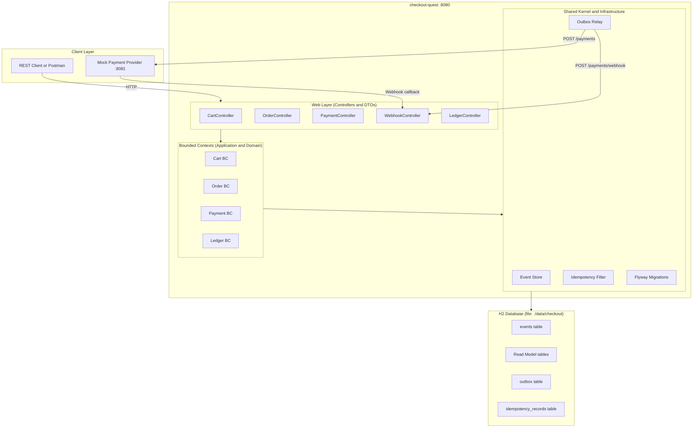
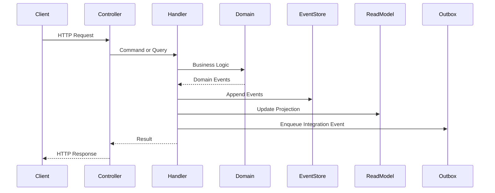
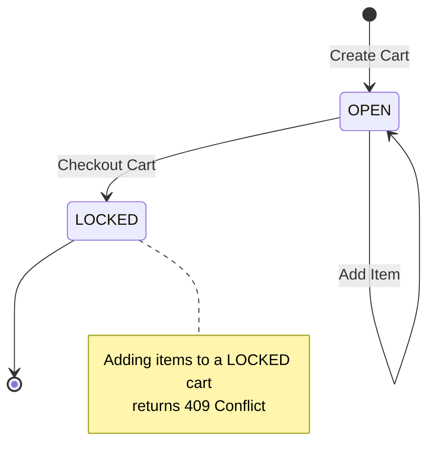
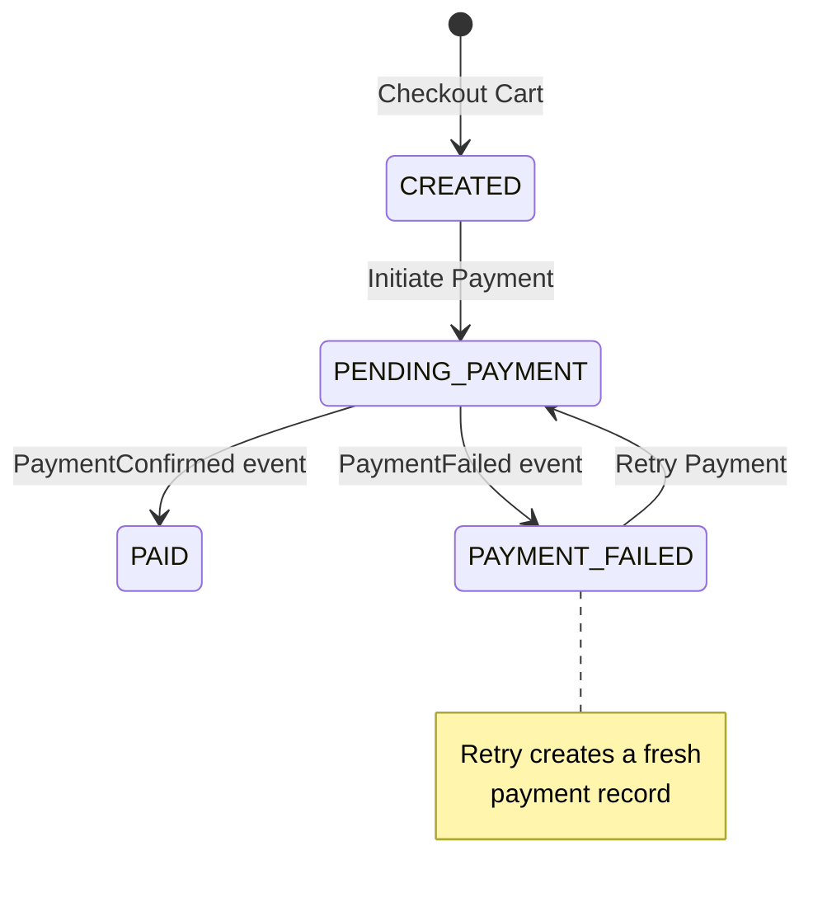
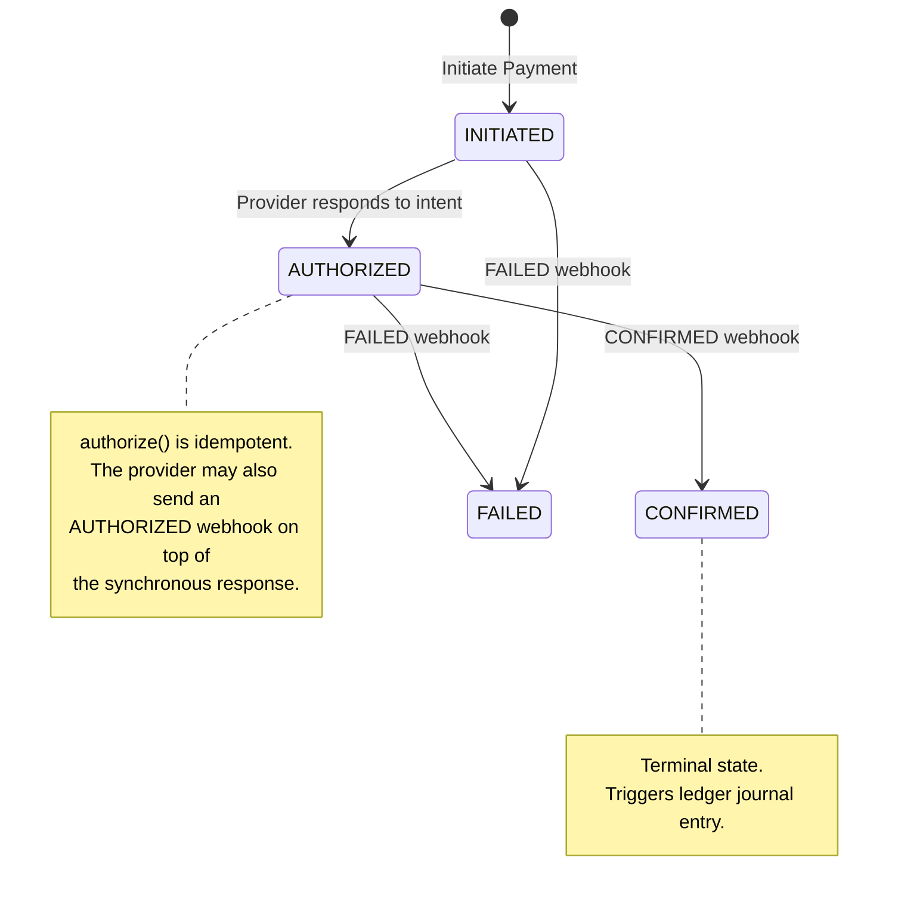
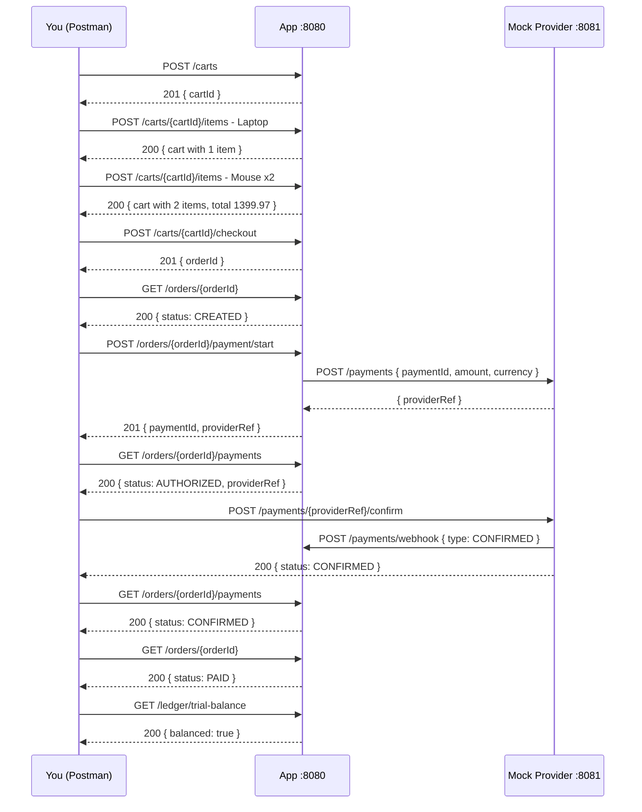
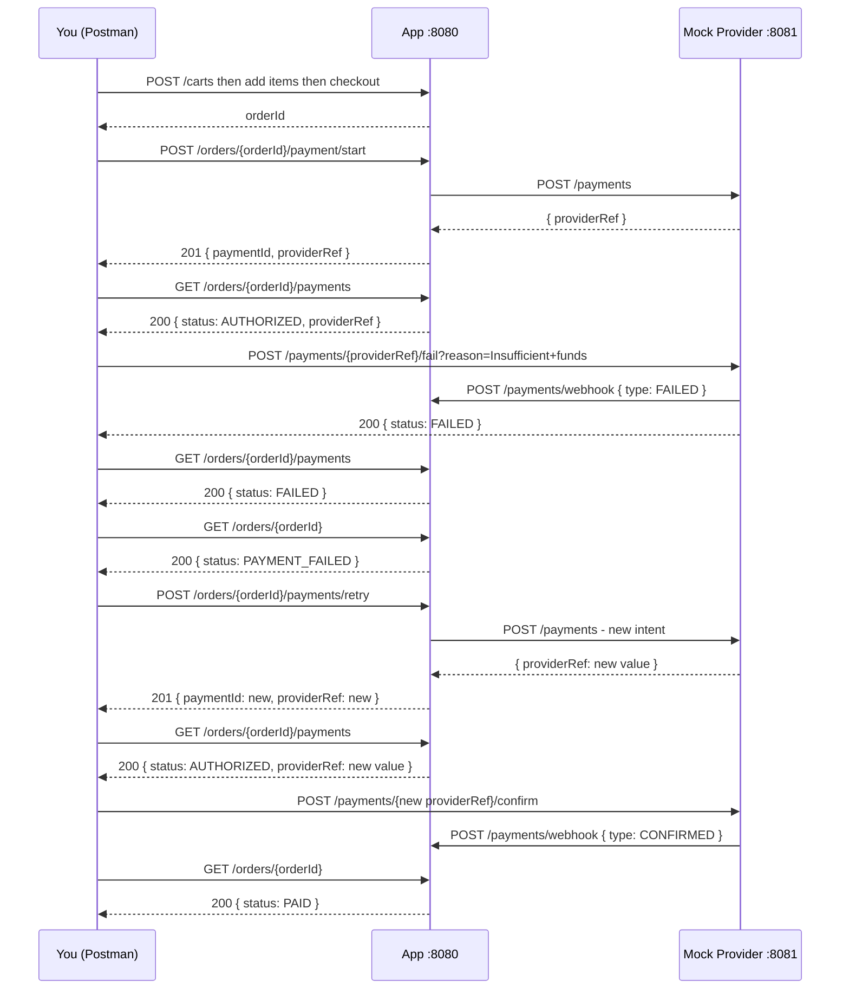

# Checkout Quest - Developer Guide

This is a production-grade modular monolith that walks through the complete lifecycle of a purchase, from adding items to a cart all the way through to a confirmed payment and a balanced set of accounting books. Every bounded context lives inside the same JVM process and the same database, but each one owns its schema, its domain model, and its event log. There are no direct package imports across context boundaries, and ArchUnit tests will fail the build if you try.

The point is to show that you do not need microservices to get the benefits of loose coupling. You get fast local tests, simple deployment, and a clean upgrade path to services if you ever need it.

---

## Table of Contents

1. [What Is This Project?](#1-what-is-this-project)
2. [Architecture at a Glance](#2-architecture-at-a-glance)
3. [Bounded Contexts](#3-bounded-contexts)
4. [Getting Started](#4-getting-started)
5. [Running the Mock Payment Provider](#5-running-the-mock-payment-provider)
6. [API Reference](#6-api-reference)
7. [State Machines](#7-state-machines)
8. [Error Responses](#8-error-responses)
9. [Postman Collection](#9-postman-collection)
10. [Happy Path Walkthrough](#10-happy-path-walkthrough)
11. [Failure Path Walkthrough](#11-failure-path-walkthrough)
12. [Inspecting the Database](#12-inspecting-the-database)
13. [Key Design Decisions](#13-key-design-decisions)

---

## 1. What Is This Project?

Checkout Quest models a real e-commerce purchase flow. You build a cart, check it out into an order, pay for it through an external payment provider, and watch the accounting books balance themselves automatically when the payment confirms. Nothing is faked or stubbed in the main application - every piece of state lives in a real H2 database backed by Flyway migrations.

The tech stack is intentionally boring in the best way:

| Concern | Choice |
|---|---|
| Language | Java 21 |
| Framework | Spring Boot 3.3.4 |
| Persistence | Spring Data JPA with H2 file-based storage |
| Migrations | Flyway, V1 through V9 |
| HTTP Client | OpenFeign |
| Mapping | MapStruct with Lombok |
| Tests | JUnit 5, Spring Boot Test, ArchUnit |
| Build | Maven |

---

## 2. Architecture at a Glance

Each bounded context follows a hexagonal structure. The shared module provides the scaffolding that everything builds on - the event store, the outbox relay, and the idempotency filter.



Every write command follows the same path through the system:



---

## 3. Bounded Contexts

**Cart** manages the shopping cart. A cart starts open, accepts items, and gets locked the moment you check it out. Once locked, it does not accept new items. Every `ItemAdded` and `CartLocked` event is stored in the event log and replayed to rebuild state.

**Order** is created from a checked-out cart. It starts in `CREATED` and follows payment-driven transitions through to `PAID` or `PAYMENT_FAILED`. The Order context learns about payment outcomes through integration events published via the outbox - it never imports from the Payment package directly.

**Payment** handles the intent creation with an external provider and processes the provider's webhooks. Authorization happens synchronously when the provider responds to the intent. The terminal state (`CONFIRMED` or `FAILED`) arrives asynchronously via webhook.

**Ledger** does the bookkeeping. Every confirmed payment results in a balanced journal entry - debit Accounts Receivable, credit Revenue. The trial balance endpoint lets you verify at any point that the books are in balance.

---

## 4. Getting Started

**Prerequisites**

- Java 21 or later
- Maven 3.9 or later
- The mock payment provider running on port 8081 (covered in the next section)

**Clone and Build**

```bash
git clone <repo-url>
cd checkout-quest
mvn clean install
```

All 33 tests should pass: 8 ArchUnit, 12 domain state-machine, 9 payment domain, and 4 integration tests.

**Run the Application**

```bash
mvn spring-boot:run
```

Or build the jar and run it directly:

```bash
mvn package -DskipTests
java -jar target/checkout-quest-1.0.0-SNAPSHOT.jar
```

The application starts on `http://localhost:8080`. The H2 database is persisted to `./data/checkout` in the working directory, so your data survives restarts.

**Configuration**

Everything lives in `src/main/resources/application.yml`. The values you are most likely to touch:

| Property | Default | Description |
|---|---|---|
| `server.port` | `8080` | HTTP port |
| `mock.provider.url` | `http://localhost:8081` | Mock payment provider base URL |
| `scheduling.outbox-relay-interval-ms` | `500` | How often the outbox relay fires, in milliseconds |
| `scheduling.outbox-max-retries` | `5` | Max delivery attempts before a message is dead-lettered |
| `spring.datasource.url` | `jdbc:h2:file:./data/checkout` | H2 file path |

---

## 5. Running the Mock Payment Provider

The mock payment provider simulates an external payment gateway. It runs on port 8081 and handles three things:

1. Accepting a payment intent (`POST /payments`) and returning a `providerRef`
2. Exposing manual control endpoints so you can trigger confirm or fail outcomes
3. Sending webhook callbacks to the application whenever you trigger a state change

Start it before running the main application. Once it is up, you can check it is responding:

```bash
curl http://localhost:8081/payments
```

You should get a JSON object listing any pending payments.

---

## 6. API Reference

All endpoints are served from `http://localhost:8080`. Request bodies are JSON. Timestamps in responses are ISO-8601 UTC strings.

---

### 6.1 Cart API

#### Create Cart

Opens a new empty shopping cart.

```
POST /carts
```

No request body needed.

**Response - 201 Created**

```json
{
  "cartId": "019e12e0-15b8-750d-bf23-cdaa9de90864"
}
```

---

#### Add Item to Cart

Adds a product to an open cart. If you try this on a locked cart, you get a 409.

```
POST /carts/{cartId}/items
```

**Path parameters**

| Parameter | Type | Description |
|---|---|---|
| `cartId` | string | The cart identifier from Create Cart |

**Request body**

```json
{
  "productId": "prod-laptop-001",
  "quantity": 1,
  "unitPrice": 1299.99,
  "currency": "USD"
}
```

| Field | Type | Rules | Description |
|---|---|---|---|
| `productId` | string | required, not blank | Your product SKU or any identifier |
| `quantity` | integer | required, minimum 1 | Number of units |
| `unitPrice` | decimal | required, minimum 0.01 | Price per unit |
| `currency` | string | required, not blank | ISO 4217 currency code, e.g. USD |

**Response - 200 OK**

```json
{
  "cartId": "019e12e0-15b8-750d-bf23-cdaa9de90864",
  "status": "OPEN",
  "totalAmount": 1299.99,
  "currency": "USD",
  "createdAt": "2026-05-10T17:00:00.000Z",
  "lockedAt": null,
  "items": [
    {
      "productId": "prod-laptop-001",
      "quantity": 1,
      "unitPriceAmount": 1299.99,
      "unitPriceCurrency": "USD"
    }
  ]
}
```

---

#### Get Cart

Fetches the current cart state along with all items and the running total.

```
GET /carts/{cartId}
```

**Path parameters**

| Parameter | Type | Description |
|---|---|---|
| `cartId` | string | The cart identifier |

The response structure is identical to the Add Item response above.

---

#### Checkout Cart

Locks the cart and creates an Order. After this call, the cart will not accept new items.

```
POST /carts/{cartId}/checkout
```

No request body needed.

**Response - 201 Created**

```json
{
  "orderId": "019e12e0-15b8-750d-bf23-cdaa9de90999"
}
```

---

### 6.2 Order API

#### Get Order

Returns the current order state. The `status` field will update as payment events arrive.

```
GET /orders/{orderId}
```

**Path parameters**

| Parameter | Type | Description |
|---|---|---|
| `orderId` | string | The order identifier from Checkout Cart |

**Response - 200 OK**

```json
{
  "orderId": "019e12e0-15b8-750d-bf23-cdaa9de90999",
  "cartId": "019e12e0-15b8-750d-bf23-cdaa9de90864",
  "status": "CREATED",
  "totalAmount": 1399.97,
  "currency": "USD",
  "createdAt": "2026-05-10T17:01:00.000Z",
  "items": [
    {
      "productId": "prod-laptop-001",
      "quantity": 1,
      "unitPriceAmount": 1299.99,
      "unitPriceCurrency": "USD"
    },
    {
      "productId": "prod-mouse-007",
      "quantity": 2,
      "unitPriceAmount": 49.99,
      "unitPriceCurrency": "USD"
    }
  ]
}
```

**What the status values mean**

| Status | What it means |
|---|---|
| `CREATED` | Order exists, no payment has been started yet |
| `PENDING_PAYMENT` | Payment initiated, waiting on the provider |
| `PAID` | Payment confirmed by the provider |
| `PAYMENT_FAILED` | Payment failed, a retry is possible |

---

### 6.3 Payment API

#### Initiate Payment

Creates a payment intent with the external provider and moves the order to `PENDING_PAYMENT`. The `providerRef` in the response is the external provider's identifier for this transaction. You will need it to trigger confirmation or failure through the mock provider.

```
POST /orders/{orderId}/payment/start
```

**Headers**

| Header | Required | Description |
|---|---|---|
| `Content-Type` | yes | application/json |
| `Idempotency-Key` | no | Any unique string. Replaying the same key returns the cached response without creating a second payment. |

**Path parameters**

| Parameter | Type | Description |
|---|---|---|
| `orderId` | string | The order to pay for |

**Request body**

```json
{
  "amount": 1399.97,
  "currency": "USD"
}
```

| Field | Type | Rules | Description |
|---|---|---|---|
| `amount` | decimal | required, minimum 0.01 | Payment amount |
| `currency` | string | required, not blank | ISO 4217 currency code |

**Response - 201 Created**

```json
{
  "paymentId": "019e12e0-15b8-750d-bf23-cdaa9de90aaa",
  "providerRef": "prov-ref-abc123"
}
```

Save the `providerRef`. You will use it to confirm or fail the payment through the mock provider.

---

#### Retry Payment

Creates a fresh payment attempt for an order whose previous payment failed. The amount and currency are carried over from the failed payment automatically.

```
POST /orders/{orderId}/payments/retry
```

**Headers**

| Header | Required | Description |
|---|---|---|
| `Idempotency-Key` | no | Unique string for safe retries |

The response structure is the same as Initiate Payment.

---

#### Get Payment

Returns the latest payment record associated with an order.

```
GET /orders/{orderId}/payments
```

**Response - 200 OK**

```json
{
  "paymentId": "019e12e0-15b8-750d-bf23-cdaa9de90aaa",
  "orderId": "019e12e0-15b8-750d-bf23-cdaa9de90999",
  "status": "AUTHORIZED",
  "amount": 1399.97,
  "currency": "USD",
  "providerRef": "prov-ref-abc123",
  "idempotencyKey": "pay-idem-xyz",
  "createdAt": "2026-05-10T17:02:00.000Z",
  "updatedAt": "2026-05-10T17:02:01.500Z"
}
```

**What the status values mean**

| Status | What it means |
|---|---|
| `INITIATED` | Intent created, waiting for the provider to authorize |
| `AUTHORIZED` | Provider has reserved the funds |
| `CONFIRMED` | Funds captured, payment is complete |
| `FAILED` | Provider declined or something went wrong |

---

### 6.4 Webhook API

The webhook endpoint is called by the payment provider - or by you through Postman - to push state transitions back into the application.

#### Handle Webhook

```
POST /payments/webhook
```

**Request body**

```json
{
  "eventId": "evt-conf-unique-id-001",
  "providerRef": "prov-ref-abc123",
  "type": "CONFIRMED",
  "reason": null
}
```

| Field | Type | Rules | Description |
|---|---|---|---|
| `eventId` | string | required, not blank | Globally unique event identifier from the provider. Replaying the same `eventId` is a safe no-op. |
| `providerRef` | string | required, not blank | The provider's payment reference |
| `type` | string | required | One of AUTHORIZED, CONFIRMED, or FAILED |
| `reason` | string | optional | Human-readable reason, mainly useful for FAILED webhooks |

**Response - 200 OK** with an empty body. Any 200 means the webhook was accepted, including idempotent replays.

---

### 6.5 Ledger API

#### Get Chart of Accounts

Returns all ledger accounts and their current balances.

```
GET /ledger/accounts
```

**Response - 200 OK**

```json
[
  {
    "accountId": "acc-001",
    "code": "1100",
    "name": "Accounts Receivable",
    "type": "ASSET",
    "normalBalance": "DEBIT",
    "balanceAmount": 1399.97,
    "currency": "USD"
  },
  {
    "accountId": "acc-002",
    "code": "4000",
    "name": "Revenue",
    "type": "REVENUE",
    "normalBalance": "CREDIT",
    "balanceAmount": 1399.97,
    "currency": "USD"
  }
]
```

---

#### Get Journal Entries

Returns all posted journal entries. Each entry is balanced - debits and credits always match within a single entry.

```
GET /ledger/journal-entries
```

**Response - 200 OK**

```json
[
  {
    "entryId": "je-001",
    "referenceId": "019e12e0-15b8-750d-bf23-cdaa9de90aaa",
    "referenceType": "payment",
    "postedAt": "2026-05-10T17:03:00.000Z",
    "lines": [
      {
        "accountCode": "1100",
        "amount": 1399.97,
        "currency": "USD",
        "side": "DEBIT",
        "description": "Payment confirmed"
      },
      {
        "accountCode": "4000",
        "amount": 1399.97,
        "currency": "USD",
        "side": "CREDIT",
        "description": "Payment confirmed"
      }
    ]
  }
]
```

---

#### Get Trial Balance

Returns aggregated balances across all accounts and a simple boolean telling you whether the books are in balance. After any confirmed payment, `balanced` should always be `true`.

```
GET /ledger/trial-balance
```

**Response - 200 OK**

```json
{
  "accounts": [ "..." ],
  "totalDebitBalances": 1399.97,
  "totalCreditBalances": 1399.97,
  "balanced": true
}
```

---

## 7. State Machines

### Cart



### Order



### Payment



---

## 8. Error Responses

Every error comes back in the same shape:

```json
{
  "status": 409,
  "error": "Conflict",
  "message": "An active payment already exists for order abc-123",
  "timestamp": "2026-05-10T17:05:00.000Z"
}
```

| HTTP Status | When you will see it |
|---|---|
| 400 Bad Request | A required field is missing or fails validation |
| 404 Not Found | The cart, order, or payment does not exist |
| 409 Conflict | Cart is locked, a payment is already active for the order, or an optimistic concurrency failure occurred |
| 422 Unprocessable Entity | An invalid state transition, like trying to confirm an already-failed payment |
| 503 Service Unavailable | The payment provider is down or the circuit breaker is open |
| 500 Internal Server Error | Something unexpected happened - check the application logs |

---

## 9. Postman Collection

The collection file is `checkout-quest.postman_collection.json` in the root of the repository.

**Importing the Collection**

1. Open Postman.
2. Click Import in the top-left.
3. Drag and drop `checkout-quest.postman_collection.json` onto the dialog, or click Upload Files and select it.
4. The collection shows up as "Checkout Quest" in your sidebar.

**Collection Variables**

The collection uses variables to wire outputs from one request into the next. The test scripts populate them automatically as you run each step, so you do not need to copy and paste IDs manually.

| Variable | Where it comes from | Where it is used |
|---|---|---|
| `baseUrl` | Pre-set to http://localhost:8080 | All main application requests |
| `mockUrl` | Pre-set to http://localhost:8081 | Mock provider requests |
| `cartId` | Step 1 - Create Cart | Steps 2a, 2b, 3, 4 |
| `orderId` | Step 4 - Checkout Cart | Steps 5, 6, 7 |
| `paymentId` | Step 6 - Initiate Payment | Reference only |
| `providerRef` | Step 7 - Get Payment | Steps 8 and Webhooks |

One thing worth noting: always let Step 7 (Get Payment) capture the `providerRef`, not Step 6. Step 7 reads from the read model which is guaranteed to have the value once the payment reaches `AUTHORIZED`. Step 6 captures it from the synchronous response which is reliable in practice, but Step 7 is the safe source of truth.

**Running the Full Collection**

Right-click the Checkout Quest collection in the sidebar and choose "Run collection". Make sure the requests are in step order, then click "Run Checkout Quest". The runner will go through each request, populate variables, and check the expected status codes for you.

---

## 10. Happy Path Walkthrough

This is the end-to-end flow for a purchase that goes through successfully.



**Step 1 - Create a Cart**

Send `POST /carts`. You get back a `cartId`. Postman saves it automatically.

---

**Step 2a - Add the First Item**

Send `POST /carts/{{cartId}}/items` with:

```json
{
  "productId": "prod-laptop-001",
  "quantity": 1,
  "unitPrice": 1299.99,
  "currency": "USD"
}
```

The response shows `status: "OPEN"` and one item in the list.

---

**Step 2b - Add a Second Item**

Send `POST /carts/{{cartId}}/items` with:

```json
{
  "productId": "prod-mouse-007",
  "quantity": 2,
  "unitPrice": 49.99,
  "currency": "USD"
}
```

The `totalAmount` should now be `1399.97`, which is 1 laptop at 1299.99 plus 2 mice at 49.99 each.

---

**Step 3 - Check the Cart**

Send `GET /carts/{{cartId}}`. You should see two items and the correct total.

---

**Step 4 - Checkout**

Send `POST /carts/{{cartId}}/checkout`. You get back an `orderId`. The cart is now locked - any further add-item requests will return a 409. Postman saves the `orderId`.

---

**Step 5 - Look at the Order**

Send `GET /orders/{{orderId}}`. Status should be `CREATED`.

---

**Step 6 - Initiate Payment**

Send `POST /orders/{{orderId}}/payment/start` with an `Idempotency-Key` header and this body:

```json
{
  "amount": 1399.97,
  "currency": "USD"
}
```

The application calls the mock provider, gets a `providerRef` back, and returns both `paymentId` and `providerRef` to you. The order moves to `PENDING_PAYMENT`.

---

**Step 7 - Confirm the Payment Is Authorized**

Send `GET /orders/{{orderId}}/payments`. Status should be `AUTHORIZED`. This step is important because Postman's test script captures the `providerRef` from the read model here, which is what you will need in the next step.

---

**Step 8 - Confirm Through the Mock Provider**

Send `POST {{mockUrl}}/payments/{{providerRef}}/confirm`. The mock provider updates its internal state and fires a `CONFIRMED` webhook back to the application. You should get a 200 response with `status: CONFIRMED`.

---

**Step 9 - Verify the Payment**

Send `GET /orders/{{orderId}}/payments`. Status should now be `CONFIRMED`.

---

**Step 10 - Verify the Order**

Send `GET /orders/{{orderId}}`. Status should now be `PAID`.

---

**Step 11 - Check the Books**

Send `GET /ledger/trial-balance`. The response should show `balanced: true` with equal debit and credit totals.

If you want to see the actual journal entry, hit `GET /ledger/journal-entries` as well.

---

## 11. Failure Path Walkthrough

This covers what happens when a payment fails and you need to retry - a normal scenario in any payment system.



**Steps 1 through 7** are the same as the happy path. Create the cart, add items, check out, initiate payment, and make sure you have the `providerRef` from Step 7.

---

**Step 8 - Fail the Payment**

Instead of confirming, send:

```
POST {{mockUrl}}/payments/{{providerRef}}/fail?reason=Insufficient+funds
```

The mock provider fires a `FAILED` webhook. The payment moves to `FAILED` and the order moves to `PAYMENT_FAILED`.

---

**Step 9 - Check the Failure**

`GET /orders/{{orderId}}/payments` shows `status: FAILED`.

`GET /orders/{{orderId}}` shows `status: PAYMENT_FAILED`.

The ledger will have no entries yet because no payment has been confirmed.

---

**Step 10 - Retry the Payment**

Send `POST /orders/{{orderId}}/payments/retry` with no body. The system creates a new payment record using the same amount and currency from the failed one, then issues a fresh intent to the mock provider. You get back a new `paymentId` and a new `providerRef`.

---

**Step 11 - Capture the New providerRef**

Send `GET /orders/{{orderId}}/payments`. Status should be `AUTHORIZED`. Postman captures the new `providerRef` from this response.

---

**Step 12 - Confirm the Retry**

Send `POST {{mockUrl}}/payments/{{providerRef}}/confirm` using the new `providerRef`.

---

**Step 13 - Everything Should Be Green**

`GET /orders/{{orderId}}` shows `status: PAID`.

`GET /ledger/trial-balance` shows `balanced: true`.

---

### Other Scenarios Worth Trying

**Duplicate Payment Attempt**

After Step 6 (Initiate Payment), try initiating payment again for the same order:

```
POST /orders/{{orderId}}/payment/start
```

You should get `409 Conflict` with a message like "An active payment already exists for order xyz".

---

**Checkout a Cart That Does Not Exist**

```
POST /carts/this-cart-does-not-exist/checkout
```

Returns 404 Not Found.

---

**Add an Item to a Locked Cart**

After Step 4 (Checkout Cart), try adding another item to the same cart:

```
POST /carts/{{cartId}}/items
```

Returns 409 Conflict.

---

**Replay a Webhook**

After the mock provider confirms the payment, send the exact same webhook again using the same `eventId`:

```json
{
  "eventId": "evt-conf-duplicate-fixed-id",
  "providerRef": "{{providerRef}}",
  "type": "CONFIRMED",
  "reason": null
}
```

The system deduplicates by `eventId` and returns 200 without reprocessing. The ledger does not double-post.

---

**Idempotency Key Replay**

Use the same `Idempotency-Key` header value on two separate calls to `POST /orders/{orderId}/payment/start`. The second call returns the cached 201 response from the first. No second payment is created.

---

## 12. Inspecting the Database

The H2 web console is available at `http://localhost:8080/h2-console`.

**Connection settings**

| Field | Value |
|---|---|
| Driver Class | org.h2.Driver |
| JDBC URL | jdbc:h2:file:./data/checkout |
| User Name | sa |
| Password | leave blank |

**Useful Queries**

See all domain events for a specific payment in version order:

```sql
SELECT event_id, stream_id, version, event_type, occurred_at, payload
FROM events
WHERE stream_id = '<your-payment-id>'
ORDER BY version;
```

Check outbox messages, including any that have been dead-lettered:

```sql
SELECT id, event_type, aggregate_id, dispatched_at, attempt_count, dead, dead_reason
FROM outbox
ORDER BY created_at DESC;
```

See which webhook events have already been processed:

```sql
SELECT * FROM processed_webhook_events ORDER BY processed_at DESC;
```

Browse idempotency records to see cached responses:

```sql
SELECT idempotency_key, endpoint, status, status_code, created_at, completed_at
FROM idempotency_records
ORDER BY created_at DESC;
```

---

## 13. Key Design Decisions

**Why a Modular Monolith?**

Microservices introduce distributed systems problems before a team has validated that the service boundary is even correct. Network partitions, distributed tracing, cross-service transactions - none of that is free. A modular monolith lets you enforce the same architectural boundaries through code: no cross-context package imports, context-owned read models, integration only through the outbox. Local development stays simple, tests run fast, and if a context genuinely needs to become its own service later, that becomes an extraction rather than a redesign.

**Why Event Sourcing?**

The event log is the source of truth. Every state change is an immutable, ordered fact. You get a full audit trail without extra effort, temporal queries become possible (what was the state of this payment at exactly 17:03?), and the read models are just projections that can be rebuilt at any time by replaying the event stream.

**Why the Outbox Pattern?**

Writing to an external service inside a database transaction is risky. If the external call succeeds but the transaction rolls back, you have created a phantom event in the world with no record of it on your side. The outbox pattern solves this by writing the event to an `outbox` table in the same transaction as the domain changes. A background relay handles delivery. The relay retries on transient failures and dead-letters messages that fail due to non-retryable business exceptions, giving you at-least-once delivery with a clear story for what to do when things go wrong.

**Why Double-Entry Bookkeeping?**

Every financial system eventually needs an audit trail that cannot lie. Double-entry bookkeeping enforces that every credit has a matching debit. If the trial balance is unbalanced, you know immediately that something went wrong. It is far cheaper to build it in from the start than to retrofit it after money has already moved.

**Idempotency at Three Layers**

Payment operations are protected at three distinct points. The HTTP idempotency filter stores the first response and replays it verbatim on duplicate requests with the same key. A database uniqueness constraint ensures that even if two requests race past the filter simultaneously, only one active payment per order can exist. Webhook deduplication using `processed_webhook_events` ensures that a provider redelivering the same event is a no-op at the domain level.

**Circuit Breaker on the Payment Gateway**

The `MockPaymentGateway` wraps its outbound call to the payment provider inside a Resilience4J circuit breaker. When the provider is healthy everything is transparent. When failures exceed the threshold the circuit opens, and subsequent calls fail immediately rather than hanging until a timeout. This protects the rest of the system from being held hostage by an unresponsive upstream dependency.

The circuit is tuned conservatively: it evaluates the last 5 calls and opens at 50% failure rate, but requires at least 3 calls before it will open at all so a single bad request on startup does not trigger it. Once open, it stays open for 10 seconds before switching to half-open and allowing 2 probe calls through to decide whether the provider has recovered.

From the API caller's perspective, a tripped circuit breaker returns a 503 Service Unavailable rather than a timeout after 5 seconds. The circuit is named `payment-provider` so you can observe its state in the Actuator health endpoint if you add `management.endpoints.web.exposure.include=health,circuitbreakers` to your configuration.
